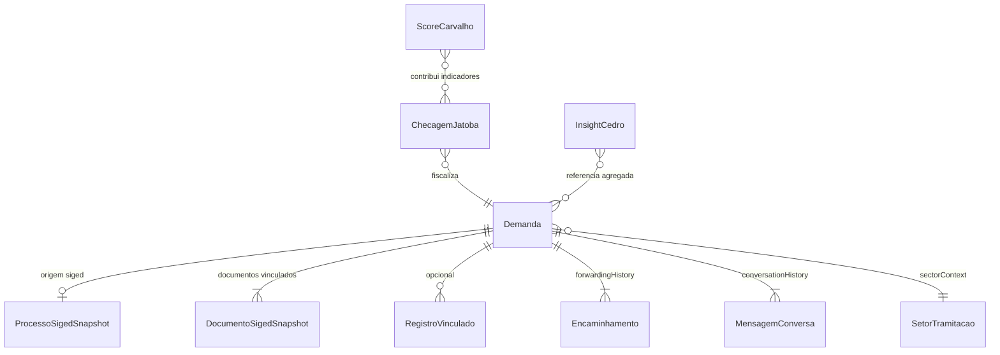
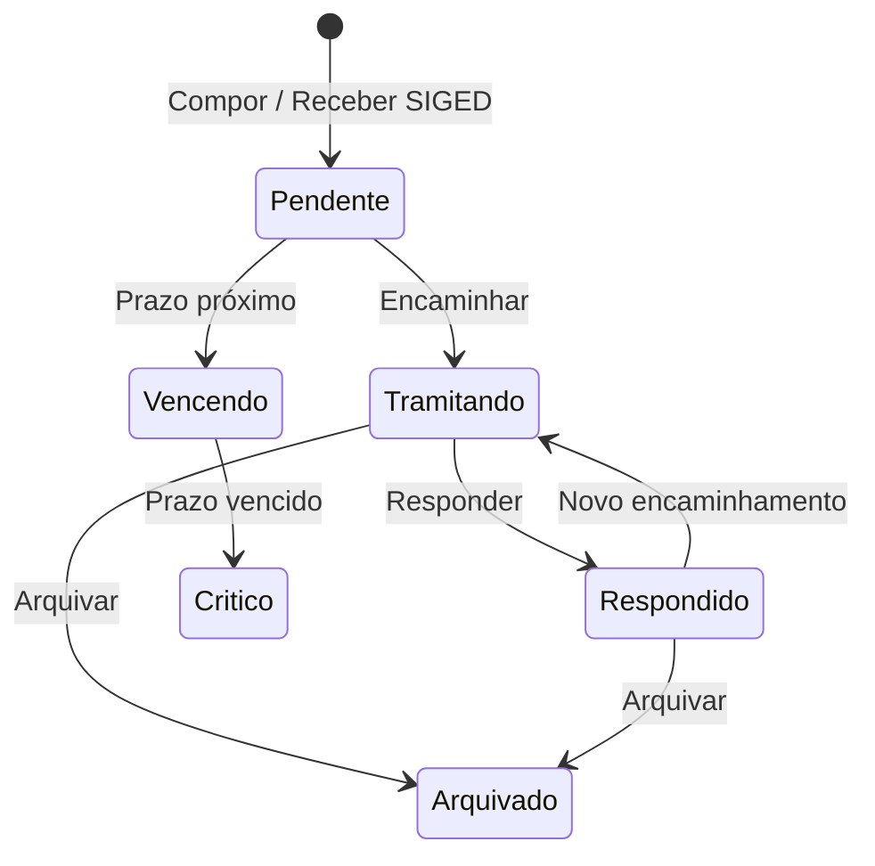

# Data Model: Tramitação — Demandas SIGED e Licenças (Mock)

**Feature**: 005-tramitacao-siged-licencas  
**Storage**: TypeScript fixtures em `ci-client-v2/apps/web/src/modules/shell/data/`  
**API**: N/A nesta fase

## Enums e conjuntos fechados

### OrigemDemanda

| Valor | UI |
|-------|-----|
| `interna` | *(sem badge)* ou rótulo discreto "Interna" |
| `siged` | Badge obrigatório **SIGED** |

### PastaDemanda

| Valor | Descrição |
|-------|-----------|
| `recebidas` | Inbox do setor destinatário |
| `enviadas` | Saídas do setor remetente |
| `arquivadas` | Histórico arquivado |

### StatusOperacional (Base)

`Pendente` | `Tramitando` | `Respondido` | `Crítico` | `Vencendo` | `Arquivado`

**Regra**: derivado de `prazo`, `folder`, último evento — **não** persistido como fonte de verdade em fixture; função `deriveOperationalStatus`.

### ConformidadeJatoba

`Conforme` | `Não conforme` | `Parcial` | `Pendente` — apenas em telas/painéis Jatobá.

### ImpactoCedro

`Crítico` | `Alto` | `Médio`

### StatusAssinaturaDocumento

`Pendente` | `Concluída` | `Não aplicável`

---

## Entidades

### Demanda (`TramitacaoMessage` estendido)

| Campo | Tipo | Obrigatório | Notas |
|-------|------|-------------|-------|
| `id` | string | sim | `msg-*` |
| `origem` | OrigemDemanda | sim | default `interna` para retrocompat |
| `folder` | PastaDemanda | sim | |
| `sectorContext` | string | sim | id setor ativo (ex.: `dejur`) |
| `unread` | boolean | sim | |
| `subject` | string | sim | |
| `preview` | string | sim | |
| `body` | string | sim | |
| `receivedAt` | string | sim | display |
| `date` | string | sim | lista compacta |
| `from` | `{ name, sector, sectorSigla }` | sim | |
| `to` | string[] | sim | |
| `toLabel` | string | sim | |
| `tags` | string[] | sim | |
| `deadlineStatus` | `sem-prazo` \| `com-prazo` | não | |
| `prazo` | string (DD/MM/YYYY) | não | prazo operacional Base |
| `attachments` | number | sim | contagem |
| `messageId` | string (UUID) | sim | |
| `linkedRecords` | RegistroVinculado[] | sim | pode ser `[]` |
| `forwardingHistory` | Encaminhamento[] | sim | |
| `conversationHistory` | MensagemConversa[] | sim | |
| `processoSiged` | ProcessoSigedSnapshot | condicional | obrigatório se `origem === 'siged'` |
| `documentosSiged` | DocumentoSigedSnapshot[] | condicional | pode ser `[]` |

### ProcessoSigedSnapshot

| Campo | Tipo | Exemplo mock |
|-------|------|--------------|
| `protocolo` | string | `SIGED-2026-0042817` |
| `tipo` | string | `Processo Administrativo` |
| `secretariaOrigem` | string | `SEMEF` |
| `assunto` | string | `Solicitação de parecer jurídico` |
| `statusProcesso` | string | `Em tramitação` |
| `recebidoEm` | string | `02/06/2026` |

### DocumentoSigedSnapshot

| Campo | Tipo | Exemplo mock |
|-------|------|--------------|
| `id` | string | `doc-sig-1` |
| `tipo` | string | `Ofício` |
| `numero` | string | `OF-12847/2026` |
| `statusAssinatura` | StatusAssinaturaDocumento | `Pendente` |

### RegistroVinculado (`TramitacaoLinkedRecord`)

| Campo | Tipo |
|-------|------|
| `id` | string |
| `type` | string | ex.: `MANIFESTATION` |
| `label` | string |
| `number` | string | ex.: `OUV-2026-0142` |
| `status` | string |
| `snapshotAt` | string |

### Encaminhamento / MensagemConversa (`TramitacaoHistoryEntry`)

| Campo | Tipo |
|-------|------|
| `id` | string |
| `kind` | `inicio` \| `resposta` \| `encaminhamento` |
| `from` | string |
| `to` | string |
| `subject` | string |
| `body` | string |
| `date` | string |
| `tags` | string[] | opcional |
| `prazo` | string | opcional |

### SetorTramitacao (`TramitacaoSector`)

| Campo | Tipo |
|-------|------|
| `id` | string |
| `sigla` | string |
| `name` | string |
| `isMember` | boolean | usuário mock membro |

---

## Entidades de licença (mock agregado)

### ChecagemJatoba (linha `tramitacao-auditoria`)

| Campo | Fonte mock |
|-------|------------|
| `registro` | id demanda / assunto |
| `dados` | texto fiscalizado |
| `questionario` | nome checklist |
| `destinatario` | `Interno` |
| `canal` | `Portal interno` |
| `conformidade` | enum Jatobá |
| `problemas` | texto achado |

### InsightCedro (`cedroInsightsByModule.tramitacao`)

| Campo | Tipo |
|-------|------|
| `id` | string |
| `title` | string |
| `impact` | ImpactoCedro |
| `summary` | string |

### ScoreCarvalho (`maturityByModule.tramitacao`)

| Campo | Tipo |
|-------|------|
| `label` | `Tramitação` |
| `overall` | number 0–100 |
| `jatobaContribution` | number % |
| `scores` | Record&lt;Controle Interno \| Governança \| TI, number&gt; |

### ModeloPauBrasil (composição)

| Campo | Tipo |
|-------|------|
| `tipo` | `Ofício` \| `Memorando` \| `Despacho` |
| `corpoPreenchido` | string template |
| `alertaNormativo` | string | opcional |

---

## Relacionamentos

---

## Transições de estado (operacional)

**Nota**: Jatobá observa estados mas **não** dispara transições.

---

## Validações (mock)

| Regra | Onde |
|-------|------|
| `origem === 'siged'` ⇒ `processoSiged` definido | TypeScript discriminated union |
| `documentosSiged` pode ser `[]` | US edge case |
| Conformidade Jatobá ∉ status operacional | UI separation |
| SLA &gt; 2 dias úteis ⇒ achado Jatobá | regra `JAT-TRAM-SLA-001` em traceability |
| Assinatura pendente em doc SIGED ⇒ achado | `JAT-TRAM-SIG-002` |

---

## Fixtures canônicos (referência)

Ver [contracts/mock-data-layout.md](./contracts/mock-data-layout.md) para IDs e contagens mínimas.
