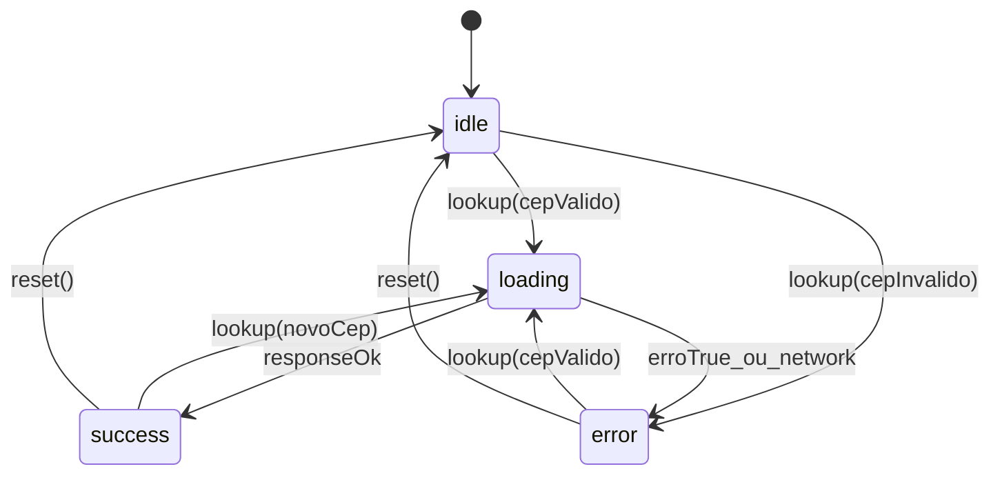
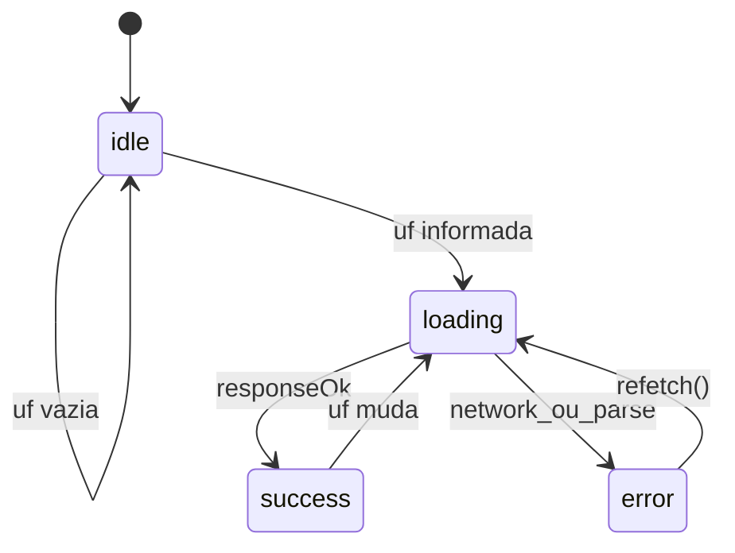

# Data Model: Shared Address Hooks (Client)

**Feature**: 006-shared-address-hooks  
**Storage**: Tipos TypeScript em `modules/shared/`; persistência server-side via API `Address` (Prisma)  
**External**: ViaCEP, IBGE (transitório, não persistido)

## Alinhamento Prisma (fonte de verdade)

Referência: [address.prisma](../../ci-api-v2/prisma/schema/address.prisma), [municipio.prisma](../../ci-api-v2/prisma/schema/municipio.prisma)

| Prisma `Address` | Client `AddressInput` | UI label (PT-BR) |
|------------------|----------------------|------------------|
| `postalCode` | `postalCode?` | CEP |
| `street` | `street?` | Logradouro |
| `number` | `number?` | Número |
| `complement` | `complement?` | Complemento |
| `landmark` | `landmark?` | Ponto de referência |
| `neighborhood` | `neighborhood?` | Bairro |
| `zone` | `zone?` | Zona |
| `municipioIbge` | `municipioIbge?` | Município (código IBGE) |

**Regra**: Nenhum campo além destes no objeto de captura client-side.

---

## Tipos client

### AddressInput

```typescript
interface AddressInput {
  postalCode?: string
  street?: string
  number?: string
  complement?: string
  landmark?: string
  neighborhood?: string
  zone?: string
  municipioIbge?: string  // 7 dígitos, FK lógica → Municipio.codigoIbge
}
```

### MunicipioOption

```typescript
interface MunicipioOption {
  codigoIbge: string  // @db.VarChar(7)
  nome: string
  uf: string          // @db.VarChar(2)
}
```

### UfOption

```typescript
interface UfOption {
  sigla: string  // 2 chars
  nome: string
}
```

---

## Respostas externas (transitórias)

### ViaCepResponse (raw)

| Campo ViaCEP | Tipo | Mapeia para |
|--------------|------|-------------|
| `cep` | string | `postalCode` (normalizado) |
| `logradouro` | string | `street` |
| `bairro` | string | `neighborhood` |
| `localidade` | string | *(display only — não persistido)* |
| `uf` | string | UF do seletor |
| `ibge` | string | `municipioIbge` |
| `erro` | `"true"` \| undefined | → estado `not_found` |

Campos ViaCEP ignorados na persistência: `complemento`, `unidade`, `estado`, `regiao`, `gia`, `ddd`, `siafi`.

### IbgeMunicipioRaw

| Campo IBGE | Tipo | Mapeia para |
|------------|------|-------------|
| `id` | number | `codigoIbge` (pad 7) |
| `nome` | string | `nome` |
| `microrregiao.mesorregiao.UF.sigla` | string | `uf` |

---

## Estados de hook

### UseViaCepState

```typescript
type ViaCepStatus = 'idle' | 'loading' | 'success' | 'error'

interface UseViaCepResult {
  status: ViaCepStatus
  data: Partial<AddressInput> | null
  error: ViaCepError | null
  lookup: (cep: string) => void
  reset: () => void
}

type ViaCepErrorCode =
  | 'invalid_cep'
  | 'cep_not_found'
  | 'service_unavailable'
```

### UseIbgeMunicipiosState

```typescript
type IbgeMunicipiosStatus = 'idle' | 'loading' | 'success' | 'error'

interface UseIbgeMunicipiosResult {
  status: IbgeMunicipiosStatus
  municipios: MunicipioOption[]
  error: IbgeMunicipiosError | null
  refetch: () => void
}
```

---

## Transições de estado — useViaCep



---

## Transições de estado — useIbgeMunicipios



**Regra FR-012**: Ao mudar UF, `municipioIbge` selecionado no formulário MUST ser limpo (transição `success → loading` com reset de seleção).

---

## Regras de merge — auto-preenchimento CEP

Quando lookup CEP retorna sucesso, aplicar patch **somente** nos campos derivados:

| Campo | Sobrescrever? |
|-------|---------------|
| `postalCode` | sim |
| `street` | sim |
| `neighborhood` | sim |
| `municipioIbge` | sim |
| `number` | **não** |
| `complement` | **não** |
| `landmark` | **não** |
| `zone` | **não** |

---

## Validações

| Regra | Função | Mensagem |
|-------|--------|----------|
| CEP 8 dígitos | `isValidCep(cep)` | CEP inválido. Informe 8 dígitos. |
| UF 2 chars | `isValidUf(uf)` | UF inválida. |
| municipioIbge 7 dígitos | regex `/^\d{7}$/` | *(validação no submit do módulo consumidor)* |

---

## Componentes — props canônicas

### AddressFormProps

| Prop | Tipo | Obrigatório |
|------|------|-------------|
| `value` | `AddressInput` | sim |
| `onChange` | `(value: AddressInput) => void` | sim |
| `disabled` | `boolean` | não |
| `className` | `string` | não |

### AddressFieldsProps

| Prop | Tipo | Obrigatório |
|------|------|-------------|
| `value` | `AddressInput` | sim |
| `onChange` | `(value: AddressInput) => void` | sim |
| `children` | `ReactNode` | sim |
| `disabled` | `boolean` | não |

Campos exportados individualmente consomem `AddressFieldsContext` internamente.
