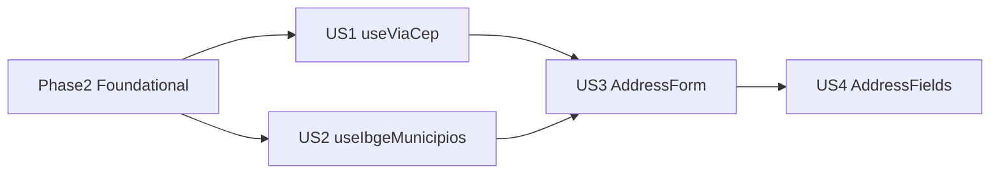

# Tasks: Shared Address Hooks

**Input**: Design documents from `specs/006-shared-address-hooks/`

**Prerequisites**: plan.md, spec.md, research.md, data-model.md, contracts/, quickstart.md

**Tests**: **Obrigatórios** — TDD (constitution II + plan.md): unitários, componente e contrato (Vitest + RTL + MSW + Zod). **Sem** testes de integração (rede real) nem E2E.

**Organization**: US1 e US2 são P1 (paralelizáveis após Foundational); US3 P2; US4 P3. Escopo **somente** `ci-client-v2/apps/web` — `ci-api-v2` fora de escopo.

## Format: `[ID] [P?] [Story] Description`

- **[P]**: Pode executar em paralelo (arquivos diferentes, sem dependências pendentes)
- **[Story]**: User story da spec (US1–US4)
- Caminhos relativos à raiz do repositório `ci-v2/`

## Phase 1: Setup (Shared Infrastructure)

**Purpose**: Infra Vitest + MSW + estrutura `modules/shared/`

- [X] T001 Adicionar dependências de teste e Zod em `ci-client-v2/apps/web/package.json` (`vitest`, `@testing-library/react`, `@testing-library/user-event`, `@testing-library/jest-dom`, `jsdom`, `msw`, `zod`) e scripts `test` / `test:watch`
- [X] T002 Configurar bloco `test` (environment `jsdom`, `setupFiles`) em `ci-client-v2/apps/web/vite.config.ts`
- [X] T003 Criar `ci-client-v2/apps/web/vitest.setup.ts` com lifecycle MSW (`beforeAll`/`afterEach`/`afterAll`) e `cleanup` RTL
- [X] T004 [P] Criar handlers MSW ViaCEP/IBGE em `ci-client-v2/apps/web/src/test/msw/handlers.ts` e `ci-client-v2/apps/web/src/test/msw/server.ts`
- [X] T005 [P] Criar fixtures JSON em `ci-client-v2/apps/web/src/modules/shared/fixtures/via-cep-success.json`, `via-cep-not-found.json`, `ibge-municipios-am.json` conforme `contracts/via-cep-integration.md` e `contracts/ibge-municipios-integration.md`
- [X] T006 Criar estrutura de pastas `ci-client-v2/apps/web/src/modules/shared/{lib,hooks,schemas,components,fixtures}/` e stub `ci-client-v2/apps/web/src/modules/shared/index.ts`

---

## Phase 2: Foundational (Blocking Prerequisites)

**Purpose**: Tipos canônicos, schemas Zod, utilitários CEP — **bloqueia todas as user stories**

**⚠️ CRITICAL**: Nenhuma user story começa antes desta fase

### Tests for Foundational (TDD — RED first)

- [X] T007 [P] Escrever testes de contrato (RED) em `ci-client-v2/apps/web/src/modules/shared/schemas/__tests__/contracts.test.ts` — CT-VCEP-001/002 e CT-IBGE-001 contra fixtures
- [X] T008 [P] Escrever testes unitários (RED) em `ci-client-v2/apps/web/src/modules/shared/lib/__tests__/cep.test.ts` — `normalizeCep`, `isValidCep` (hífen, 7/9 dígitos, letras)

### Implementation for Foundational

- [X] T009 Criar tipos canônicos `AddressInput`, `MunicipioOption`, `UfOption`, códigos de erro em `ci-client-v2/apps/web/src/modules/shared/lib/address-types.ts` conforme `data-model.md`
- [X] T010 [P] Criar lista estática 27 UFs em `ci-client-v2/apps/web/src/modules/shared/lib/brazilian-ufs.ts` com `isValidUf()`
- [X] T011 [P] Implementar schemas Zod em `ci-client-v2/apps/web/src/modules/shared/schemas/via-cep.schema.ts` e `ci-client-v2/apps/web/src/modules/shared/schemas/ibge-municipio.schema.ts` (GREEN `contracts.test.ts`)
- [X] T012 Implementar `normalizeCep` e `isValidCep` em `ci-client-v2/apps/web/src/modules/shared/lib/cep.ts` (GREEN `cep.test.ts`)
- [X] T013 Atualizar `ci-client-v2/apps/web/src/modules/address/api/types.ts` para reexportar de `@/modules/shared/lib/address-types` conforme `contracts/shared-address-api.md`

**Checkpoint**: Foundation ready — tipos únicos, schemas validam fixtures, CEP normalizado

---

## Phase 3: User Story 1 — Auto-preencher endereço por CEP (Priority: P1) 🎯 MVP

**Goal**: Hook `useViaCep` consulta ViaCEP e mapeia para `AddressInput` parcial com debounce, abort e mensagens de erro

**Independent Test**: `npm run test` passa `useViaCep.test.tsx` + `via-cep.test.ts`; VS-001/VS-002/VS-004 em `quickstart.md`

### Tests for User Story 1 (TDD — RED first)

- [X] T014 [P] [US1] Escrever testes unitários+contrato (RED) em `ci-client-v2/apps/web/src/modules/shared/lib/__tests__/via-cep.test.ts` — CT-VCEP-003/004/005, `mapViaCepToAddress`, `parseViaCepResponse`
- [X] T015 [P] [US1] Escrever testes de componente/hook (RED) em `ci-client-v2/apps/web/src/modules/shared/hooks/__tests__/useViaCep.test.tsx` — loading→success, invalid_cep, cep_not_found, abort, debounce 300ms

### Implementation for User Story 1

- [X] T016 [US1] Implementar `fetchViaCep`, `mapViaCepToAddress`, `parseViaCepResponse` em `ci-client-v2/apps/web/src/modules/shared/lib/via-cep.ts` (GREEN `via-cep.test.ts`)
- [X] T017 [US1] Implementar hook `useViaCep` com debounce, AbortController e estados `idle|loading|success|error` em `ci-client-v2/apps/web/src/modules/shared/hooks/useViaCep.ts` (GREEN `useViaCep.test.tsx`)
- [X] T018 [US1] Exportar `useViaCep` em `ci-client-v2/apps/web/src/modules/shared/hooks/index.ts` e `ci-client-v2/apps/web/src/modules/shared/index.ts`

**Checkpoint**: MVP — lookup CEP funcional isolado; merge preserva number/complement/landmark (FR-006)

---

## Phase 4: User Story 2 — Selecionar município por UF (Priority: P1)

**Goal**: Hook `useIbgeMunicipios(uf)` lista municípios IBGE ordenados; idle sem UF; limpa seleção ao trocar UF

**Independent Test**: `npm run test` passa `useIbgeMunicipios.test.tsx` + `ibge-municipios.test.ts`; VS-003 em `quickstart.md`

> **Paralelo**: Phase 3 (US1) e Phase 4 (US2) podem ser executadas em paralelo após Phase 2 — arquivos distintos, sem dependência cruzada.

### Tests for User Story 2 (TDD — RED first)

- [X] T019 [P] [US2] Escrever testes unitários+contrato (RED) em `ci-client-v2/apps/web/src/modules/shared/lib/__tests__/ibge-municipios.test.ts` — CT-IBGE-002/003/004/005, `mapIbgeMunicipio`, `sortMunicipiosByNome`
- [X] T020 [P] [US2] Escrever testes de componente/hook (RED) em `ci-client-v2/apps/web/src/modules/shared/hooks/__tests__/useIbgeMunicipios.test.tsx` — uf vazia idle, success list, error, uf change abort

### Implementation for User Story 2

- [X] T021 [US2] Implementar `fetchMunicipiosByUf`, `mapIbgeMunicipio`, `sortMunicipiosByNome` em `ci-client-v2/apps/web/src/modules/shared/lib/ibge-municipios.ts` (GREEN `ibge-municipios.test.ts`)
- [X] T022 [US2] Implementar hook `useIbgeMunicipios` em `ci-client-v2/apps/web/src/modules/shared/hooks/useIbgeMunicipios.ts` (GREEN `useIbgeMunicipios.test.tsx`)
- [X] T023 [US2] Exportar `useIbgeMunicipios` em `ci-client-v2/apps/web/src/modules/shared/hooks/index.ts` e `ci-client-v2/apps/web/src/modules/shared/index.ts`

**Checkpoint**: Lista municípios por UF funcional isolada

---

## Phase 5: User Story 3 — Formulário de endereço reutilizável (Priority: P2)

**Goal**: `AddressForm` controlado com todos os campos canônicos, integração CEP + UF/município, estados loading/erro

**Independent Test**: `npm run test` passa `AddressForm.test.tsx` (CMP-001…CMP-007); VS-005 em `quickstart.md`

**Depends on**: Phase 3 + Phase 4 (hooks US1/US2)

### Tests for User Story 3 (TDD — RED first)

- [X] T024 [P] [US3] Escrever testes de componente (RED) em `ci-client-v2/apps/web/src/modules/shared/components/__tests__/AddressForm.test.tsx` — CMP-001…CMP-007 conforme `contracts/address-form-ui.md`

### Implementation for User Story 3

- [X] T025 [P] [US3] Criar campos shadcn individuais em `ci-client-v2/apps/web/src/modules/shared/components/fields/` (`PostalCodeField.tsx`, `StreetField.tsx`, `NumberField.tsx`, `ComplementField.tsx`, `LandmarkField.tsx`, `NeighborhoodField.tsx`, `ZoneField.tsx`, `UfSelectField.tsx`, `MunicipioSelectField.tsx`) e barrel `fields/index.ts`
- [X] T026 [US3] Implementar `AddressForm.tsx` em `ci-client-v2/apps/web/src/modules/shared/components/AddressForm.tsx` — layout grid, `value`/`onChange`, integração `useViaCep` + `useIbgeMunicipios`, mensagens erro R9 (GREEN `AddressForm.test.tsx`)
- [X] T027 [US3] Exportar `AddressForm` em `ci-client-v2/apps/web/src/modules/shared/index.ts`

**Checkpoint**: Formulário completo reutilizável; 100% campos `Address` (SC-004)

---

## Phase 6: User Story 4 — Campos de endereço composáveis (Priority: P3)

**Goal**: `AddressFields` provider + campos exportados para layouts parciais customizados

**Independent Test**: `npm run test` passa `AddressFields.test.tsx`; VS-006 em `quickstart.md`

**Depends on**: Phase 5 (campos em `fields/`)

### Tests for User Story 4 (TDD — RED first)

- [X] T028 [P] [US4] Escrever testes de componente (RED) em `ci-client-v2/apps/web/src/modules/shared/components/__tests__/AddressFields.test.tsx` — composição parcial CEP+logradouro+UF+município, context required, propagação lookup

### Implementation for User Story 4

- [X] T029 [US4] Implementar `AddressFieldsContext.tsx` em `ci-client-v2/apps/web/src/modules/shared/components/AddressFieldsContext.tsx` — value/onChange, merge CEP (FR-006), reset municipioIbge on UF change (FR-012)
- [X] T030 [US4] Implementar `AddressFields.tsx` provider em `ci-client-v2/apps/web/src/modules/shared/components/AddressFields.tsx` e refatorar campos em `fields/` para consumir contexto quando dentro do provider (GREEN `AddressFields.test.tsx`)
- [X] T031 [US4] Exportar `AddressFields`, `AddressFieldsContext` e todos os campos de `fields/` no barrel `ci-client-v2/apps/web/src/modules/shared/index.ts` conforme `contracts/shared-address-api.md`

**Checkpoint**: Composabilidade completa; import único `@/modules/shared` (SC-001)

---

## Phase 7: Polish & Cross-Cutting Concerns

**Purpose**: Validação final, gates CI, smoke manual

- [X] T032 [P] Executar `npm run test` em `ci-client-v2/apps/web` — exit 0 em todas as 8 suites (unit + component + contract)
- [X] T033 [P] Executar `npm run typecheck` e `npm run build` em `ci-client-v2` — exit 0
- [X] T034 Auditar imports: nenhum fetch ViaCEP/IBGE fora de `ci-client-v2/apps/web/src/modules/shared/lib/` (VS-007)
- [X] T035 Executar smoke manual VS-001 a VS-008 em `specs/006-shared-address-hooks/quickstart.md`
- [X] T036 Confirmar checklist pós-implementação em `specs/006-shared-address-hooks/quickstart.md`

---

## Dependencies & Execution Order

### Phase Dependencies

- **Setup (Phase 1)**: Sem dependências — iniciar imediatamente
- **Foundational (Phase 2)**: Depende de Phase 1 — **BLOQUEIA** user stories
- **US1 (Phase 3)** e **US2 (Phase 4)**: Dependem de Phase 2; **paralelizáveis entre si**
- **US3 (Phase 5)**: Depende de US1 + US2 (hooks)
- **US4 (Phase 6)**: Depende de US3 (campos base); adiciona contexto composável
- **Polish (Phase 7)**: Depende de US1–US4 desejados

### User Story Dependencies



| Story | Depende de | Testável independentemente |
|-------|------------|----------------------------|
| US1 | Foundational | Sim — hook + lib via-cep |
| US2 | Foundational | Sim — hook + lib ibge |
| US3 | US1, US2 | Sim — AddressForm com MSW |
| US4 | US3 fields | Sim — AddressFields parcial |

### Within Each User Story (TDD)

1. Escrever testes (RED) — devem falhar
2. Implementar mínimo (GREEN)
3. Refatorar se necessário
4. Checkpoint antes da próxima story

### Parallel Opportunities

- **Phase 1**: T004 ∥ T005
- **Phase 2**: T007 ∥ T008; T010 ∥ T011 (após T007 tipos se necessário)
- **Phase 3 ∥ Phase 4**: equipes diferentes em US1 e US2
- **Dentro US1**: T014 ∥ T015 (RED); após T016, T017 sequencial
- **Dentro US3**: T024 RED enquanto T025 fields em paralelo (campos stub mínimo para test compile)
- **Phase 7**: T032 ∥ T033

---

## Parallel Example: User Story 1 + User Story 2

```bash
# Após Phase 2 completa — duas frentes paralelas:

# Dev A — US1 CEP:
# T014 via-cep.test.ts (RED)
# T016 via-cep.ts (GREEN)
# T015 useViaCep.test.tsx (RED)
# T017 useViaCep.ts (GREEN)

# Dev B — US2 IBGE:
# T019 ibge-municipios.test.ts (RED)
# T021 ibge-municipios.ts (GREEN)
# T020 useIbgeMunicipios.test.tsx (RED)
# T022 useIbgeMunicipios.ts (GREEN)
```

---

## Parallel Example: User Story 3

```bash
# Testes RED enquanto campos são criados:
Task T024: "AddressForm.test.tsx (RED)"
Task T025: "fields/*.tsx" [P]
# Depois integrar:
Task T026: "AddressForm.tsx (GREEN)"
```

---

## Implementation Strategy

### MVP First (User Story 1 only)

1. Complete Phase 1: Setup
2. Complete Phase 2: Foundational
3. Complete Phase 3: User Story 1 (`useViaCep`)
4. **STOP and VALIDATE**: `npm run test` + VS-001/VS-002
5. Demo lookup CEP isolado (sem formulário completo)

### Incremental Delivery

1. Setup + Foundational → tipos e infra teste prontos
2. US1 + US2 (paralelo) → hooks CEP e municípios → testes verdes
3. US3 → AddressForm → telas de domínio podem adotar formulário completo
4. US4 → AddressFields → layouts custom
5. Polish → CI gates + quickstart

### Suggested MVP Scope

**MVP mínimo**: Phase 1 + Phase 2 + **Phase 3 (US1)** — entrega `useViaCep` testado.

**MVP recomendado para produto**: Phase 1–4 (US1 + US2) — captura CEP e municípios sem UI completa.

**Entrega completa spec**: Phase 1–7 (US1–US4 + polish).

---

## Task Summary

| Phase | Tasks | Story |
|-------|-------|-------|
| 1 Setup | T001–T006 (6) | — |
| 2 Foundational | T007–T013 (7) | — |
| 3 US1 CEP | T014–T018 (5) | US1 |
| 4 US2 IBGE | T019–T023 (5) | US2 |
| 5 US3 AddressForm | T024–T027 (4) | US3 |
| 6 US4 AddressFields | T028–T031 (4) | US4 |
| 7 Polish | T032–T036 (5) | — |
| **Total** | **36 tasks** | |

| User Story | Task count | Test tasks |
|------------|------------|------------|
| US1 | 5 | T014, T015 (RED) |
| US2 | 5 | T019, T020 (RED) |
| US3 | 4 | T024 (RED) |
| US4 | 4 | T028 (RED) |
| Foundational | 2 test + 5 impl | T007, T008 (RED) |

---

## Notes

- **Sem** testes de integração (fetch real) nem E2E — conforme plan.md e pedido do usuário
- MSW obrigatório em todos os testes que tocam ViaCEP/IBGE
- Copy de erro PT-BR: research.md R9 — não expor HTTP status ao usuário
- Campo `zone` sempre manual — ViaCEP não preenche
- Commit sugerido após cada checkpoint de story
- Próximo comando: `/speckit-implement`
