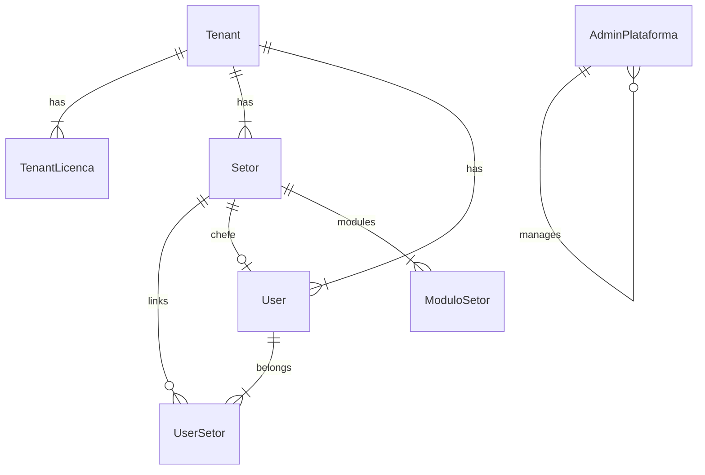

# Data Model: Super Admin SaaS App

**Feature**: 011-super-admin-saas-app  
**References**: [spec.md](./spec.md) · [research.md](./research.md) · Prisma schemas em `ci-api-v2/prisma/schema/`

## Overview

Feature **não exige migration estrutural v1** — reutiliza entidades Prisma existentes. Novas regras de negócio e contratos REST operam sobre o modelo abaixo.



---

## AdminPlataforma (Super Admin SaaS)

**Schema**: [`admin-plataforma.prisma`](../../../ci-api-v2/prisma/schema/admin-plataforma.prisma)

> **Canônico:** `AdminPlataforma` = operador **SaaS** (equipe CI). **Não** é admin de tenant. Ver `AdminTenant`.

| Campo | Tipo | Regras |
|-------|------|--------|
| `id` | UUID | PK |
| `email` | String | único global; formato e-mail |
| `passwordHash` | String | bcrypt; nunca exposto na API |
| `active` | Boolean | default `true` |
| `createdAt` | DateTime | read-only na API |
| `updatedAt` | DateTime | read-only na API |

**State transitions**:
- `active: true → false` — bloqueado se único admin ativo restante
- Super admin inativo não autentica em `/admin/auth/login`

**API DTO (response)** — nunca inclui `passwordHash`:
```typescript
{ id, email, active, createdAt, updatedAt }
```

---

## AdminTenant (Admin da instituição)

**Schema**: [`admin-tenant.prisma`](../../../ci-api-v2/prisma/schema/admin-tenant.prisma)

> **Canônico:** administrador **dentro de um tenant** (`@ci/web`). Distinto de `AdminPlataforma` (SaaS). Substitui gradualmente `User.role = admin_plataforma` (legado).

| Campo | Tipo | Regras |
|-------|------|--------|
| `id` | UUID | PK |
| `tenantId` | UUID | FK Tenant |
| `email` | String | único por tenant |
| `name` | String? | display |
| `passwordHash` | String | bcrypt |
| `active` | Boolean | default `true` |
| `deletedAt` | DateTime? | soft delete |

**Auth (futuro):** login tenant com `X-Tenant-ID`; JWT role `admin_tenant` (spec posterior).

---

## Tenant

**Schema**: [`tenant.prisma`](../../../ci-api-v2/prisma/schema/tenant.prisma)

| Campo | Tipo | Regras |
|-------|------|--------|
| `id` | UUID | PK |
| `slug` | String | único global; lowercase; `[a-z0-9-]` |
| `name` | String | min 1 char |
| `active` | Boolean | default `true` |
| `createdAt` | DateTime | read-only |
| `updatedAt` | DateTime | read-only |

**State transitions**:
- `active: false` — `TenantGuard` no app tenant rejeita login; super admin ainda lista/edita

**Create side-effect**: cria 4 `TenantLicenca` (todas licenças canônicas, `active: true` default)

---

## TenantLicenca

**Schema**: [`tenant.prisma`](../../../ci-api-v2/prisma/schema/tenant.prisma) (model `TenantLicenca`)

| Campo | Tipo | Regras |
|-------|------|--------|
| `id` | UUID | PK |
| `tenantId` | UUID | FK Tenant |
| `licenca` | `LicencaSlug` | enum: `carvalho`, `pau_brasil`, `jatoba`, `cedro` |
| `active` | Boolean | default `true` |

**Unique**: `[tenantId, licenca]`

**UI labels** (mapper): Carvalho, Pau-Brasil, Jatobá, Cedro — ver `@ci/domain` / `LICENCA_API_TO_DB`

**Toggle**: PATCH altera apenas `active`; registro nunca deletado

---

## Setor (tenant-scoped)

**Schema**: [`setor.prisma`](../../../ci-api-v2/prisma/schema/setor.prisma)

| Campo | Tipo | Regras admin |
|-------|------|--------------|
| `tenantId` | UUID | via ALS do `:tenantId` path |
| `name` | String | required |
| `sigla` | String? | max 10 chars |
| `chefeUserId` | UUID? | user do mesmo tenant |
| `deletedAt` | DateTime? | soft delete via extension |

**Relacionamentos admin**:
- `ModuloSetor` — módulos vinculados (paridade com CRUD tenant existente)

---

## User (tenant-scoped)

**Schema**: [`user.prisma`](../../../ci-api-v2/prisma/schema/user.prisma)

| Campo | Tipo | Regras admin |
|-------|------|--------------|
| `tenantId` | UUID | via ALS |
| `email` | String | único por tenant |
| `name` | String? | display |
| `passwordHash` | String | bcrypt; reset via endpoint dedicado |
| `role` | `UserRole` | `user`, `chefe_setor`, `admin_plataforma` only |
| `deletedAt` | DateTime? | soft delete = desativar |

**Unique**: `[tenantId, email]`

**Vínculos**: `UserSetor[]` — min 1 setor na criação (paridade [`createUserSchema`](../../../ci-api-v2/src/modules/setor/setor.schemas.ts))

---

## JWT — admin_saas

| Claim | Valor |
|-------|-------|
| `sub` | `AdminPlataforma.id` |
| `role` | `admin_saas` |
| `tenantId` | `"platform"` (sentinel) |
| `setorIds` | omitido ou `[]` |
| `chiefOfSetorIds` | omitido ou `[]` |

---

## Validation rules (Zod — admin-plataforma.schemas.ts)

| Schema | Campos |
|--------|--------|
| `AdminLoginBody` | email, password (min 6) |
| `CreateAdminBody` | email, password (min 6) |
| `UpdateAdminBody` | email?, active? |
| `ResetAdminPasswordBody` | password (min 6) |
| `ChangeOwnPasswordBody` | currentPassword, newPassword (min 6) |
| `CreateTenantBody` | name, slug (regex), active? |
| `UpdateTenantBody` | name?, slug?, active? |
| `ToggleLicencaBody` | active: boolean |
| Setor/User | reuse/adapt `setor.schemas.ts` — roles filtrados sem `admin_saas` |

---

## Indexes leveraged (existing)

- `AdminPlataforma.email` — unique
- `Tenant.slug` — unique
- `User.[tenantId, email]` — unique
- `TenantLicenca.[tenantId, licenca]` — unique

No new indexes required for v1.
