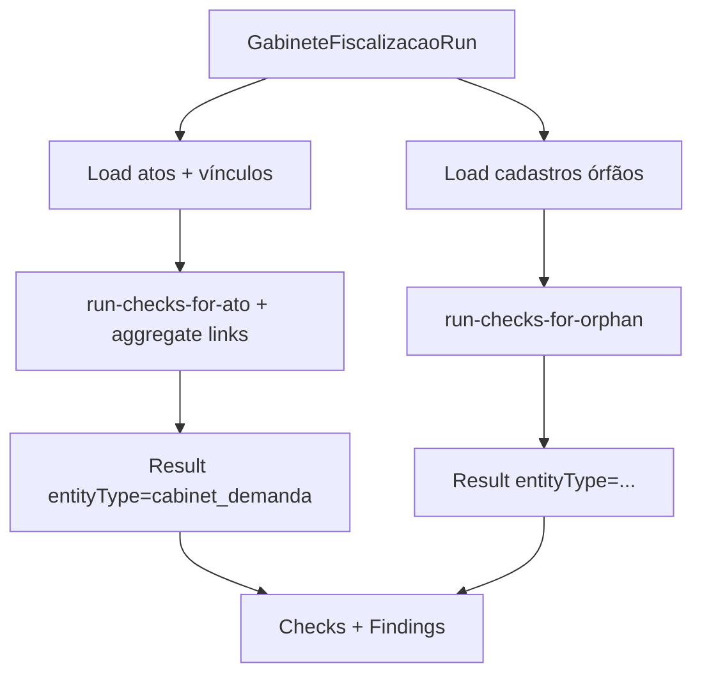

# Data Model: Fiscalização Jatobá — Gabinete

**Feature**: 016-gabinete-fiscalizacao-integrada · **Date**: 2026-06-24

> Campos Prisma/API em **inglês**; labels UI em **PT-BR** via mapper. Fonte canônica Base: [012-desmock-gabinete/data-model.md](../012-desmock-gabinete/data-model.md).

## Migration 016 — extensão Result + Questionnaire

### Enum novo: `FiscalizedEntityType`

| Valor | UI PT-BR |
|-------|----------|
| `cabinet_demanda` | Ato |
| `protocolo` | Protocolo |
| `controle_numerico` | Controle numérico |
| `notificacao` | Notificação |
| `auto_infracao` | Auto de infração |
| `documento_tramitado` | Documento tramitado |

### Alterações `GabineteFiscalizacaoResult`

| Field EN | UI PT-BR | Change | Notes |
|----------|----------|--------|-------|
| `entityType` | Tipo fiscalizado | **ADD** required | enum `FiscalizedEntityType` |
| `entityId` | — | **ADD** required | UUID do registro fiscalizado |
| `demandaId` | — | **MODIFY** optional | preenchido quando `entityType = cabinet_demanda` |
| `protocol` | Ato / Identificador | keep | snapshot legível (ex.: `GAB-2026-0001` ou label órfão) |

**Unique**: substituir `(runId, demandaId)` por `(runId, entityType, entityId)`.

**Índices**: `(tenantId, entityType, entityId, runId)`.

### Alterações `GabineteFiscalizacaoQuestionnaire`

| Field EN | Change | Notes |
|----------|--------|-------|
| `demandaId` | **MODIFY** optional | nullable para questionário sobre órfão |
| `entityType` | **ADD** optional | quando não há demandaId |
| `entityId` | **ADD** optional | FK lógica (sem constraint Prisma cross-table) |
| `audience` | constraint | sempre `internal` Gabinete |
| `channel` | constraint | sempre `portal` Gabinete |

---

## Entidades existentes (sem alteração estrutural)

### GabineteFiscalizacaoRun

Igual 008 — ver [008 data-model](../008-ouvidoria-jatoba-fiscalizacao/data-model.md). Campo `scopedDemandaId` permanece para execução por ato.

### GabineteFiscalizacaoCheck / Finding

Igual 008; `tracePayload` JSON inclui `entityType`, `entityId`, `fieldsEvaluated[]`.

### GabineteFiscalizacaoQuestion / Answer / QuestionnaireItem

Igual schema 012; seed domínio `gabinete` separado de ouvidoria.

### GabineteFiscalizacaoSlaConfig

Existente — `(tenantId, demandaStatus)` → `daysLimit`. Usado por `deadline.rules` para prazo concessionária.

---

## DTOs in-memory (lib/checks — não persistidos)

### AtoForFiscalizacao

```typescript
{
  id: string;
  protocolNumber: string;
  status: CabinetDemandaStatus;
  subject: string;
  description: string;
  concessionaireDeadline: Date | null;
  concessionaireResponseDate: Date | null;
  forwardings: unknown;
  eventos: Evento[];
  anexos: { id: string; uploadConfirmed: boolean }[];
  protocolo: ProtocoloForFiscalizacao | null;
  controlesNumericos: ControleNumericoForFiscalizacao[];
  controlesNotificacao: NotificacaoForFiscalizacao[];
  controlesAutoInfracao: AutoForFiscalizacao[];
  documentosTramitados: DocumentoTramitadoForFiscalizacao[];
}
```

### OrphanCadastroForFiscalizacao (union tipada)

Cada variante carrega `entityType`, `entityId`, `tenantId` + campos específicos do model Prisma (notificação: `groupId`, `dueDate`, `deadline`, `response`, `notificationTerm`, `addressee`; etc.).

### PairingContext

Mapa em memória na execução:

```typescript
Map<string, { notificacaoIds: string[]; autoIds: string[] }>  // key = groupId
```

---

## Fluxo de persistência por execução



---

## Regras de negócio → campos avaliados

| Checagem | Campos principais |
|----------|-------------------|
| Prazo concessionária | `concessionaireDeadline`, `concessionaireResponseDate`, `status` |
| Tramitação | `forwardings`, `eventos`, dias desde último encaminhamento |
| Completude ato | `subject`, `description` |
| Evidências | `anexos.uploadConfirmed` |
| Protocolo vínculo | `protocoloId`, `status` |
| Protocolo completude | `protocolo.sender`, `protocolo.receivedAt`, `protocolo.subject` |
| Controle numérico | `documentType`, `number`, `date` |
| Notificação prazo | `dueDate`, `deadline`, `response` |
| Notificação completude | `notificationTerm`, `addressee` |
| Auto prazo | `dueDate`, `deadline`, `response` |
| Auto completude | `issuingSector` |
| Pareamento | `groupId` + PairingContext |
| Documento tramitado | `setorId`, `dueDate`/prazo em observação |

---

## Read-only invariant

Nenhuma entidade Base (`Cabinet*`) é escrita por use-cases de `gabinete-fiscalizacao` — apenas leitura + insert/update em tabelas `GabineteFiscalizacao*`.

---

## Seed

`seed-fiscalizacao-questions-gabinete.ts` → `GabineteFiscalizacaoQuestion` (4–6 rows por tenant demo).

Chamada em `seed-jacaranda-tenant.ts` após seed gabinete demo.
