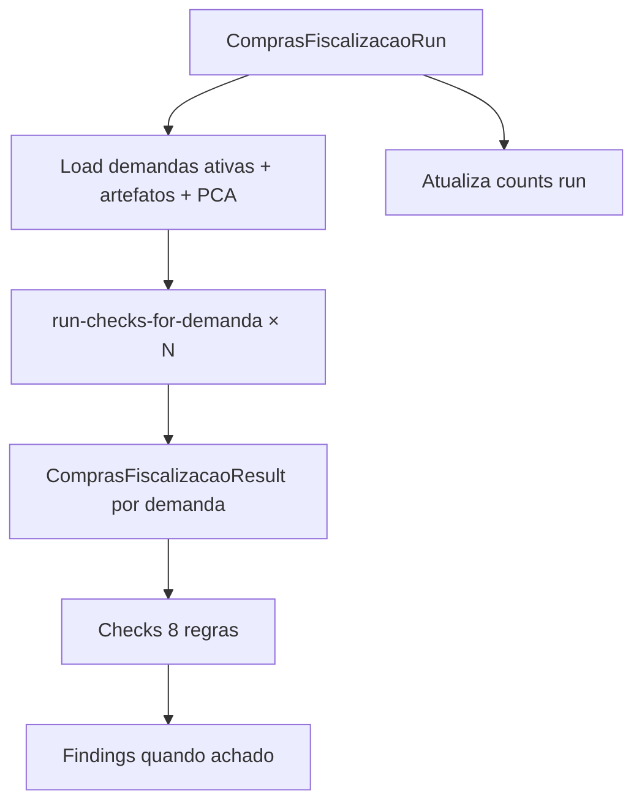

# Data Model: Fiscalização Jatobá — Compras

**Feature**: 019-purchasing-fiscalizacao · **Date**: 2026-06-25

> Campos Prisma/API em **inglês**; labels UI em **PT-BR** via mapper. Fonte canônica Base: [018-purchasing-crud/data-model.md](../arquivados/018-purchasing-crud/data-model.md).

## Schema novo: `compras-fiscalizacao.prisma`

Reutiliza enums globais de `ouvidoria-fiscalizacao.prisma`: `FiscalizacaoRunOrigin`, `FiscalizacaoRunStatus`, `ConformityStatus`.

### ComprasFiscalizacaoRun

| Field EN | UI PT-BR | Required | Notes |
|----------|----------|----------|-------|
| `id` | — | yes | UUID |
| `tenantId` | — | yes | FK Tenant |
| `startedAt` | Data/hora | yes | |
| `completedAt` | — | no | null while running |
| `origin` | Origem | yes | enum `FiscalizacaoRunOrigin` |
| `status` | Status execução | yes | `running \| completed \| failed` |
| `recordsAnalyzed` | Demandas analisadas | yes | count demandas |
| `conformeCount` | Conformes | yes | resumo run |
| `nonConformeCount` | Não conformes | yes | |
| `partialCount` | Parciais | yes | |
| `pendingCount` | Pendentes | yes | |
| `scopedDemandaId` | — | no | preenchido em execução scoped |
| `errorMessage` | — | no | se `failed` |
| `createdAt` | — | yes | |

**Índices**: `(tenantId, startedAt DESC)`, `(tenantId, origin, startedAt)`.

---

### ComprasFiscalizacaoResult

| Field EN | UI PT-BR | Required | Notes |
|----------|----------|----------|-------|
| `id` | — | yes | UUID |
| `tenantId` | — | yes | |
| `runId` | — | yes | FK Run |
| `demandaId` | Demanda | yes | FK `CompraDemanda` |
| `protocol` | Número demanda | yes | snapshot `"DEM-{number}"` |
| `pcaTitle` | PCA | yes | snapshot título PCA |
| `artefactsSummary` | Artefatos fiscalizados | yes | ex.: `"5/7 preenchidos"` |
| `conformityStatus` | Conformidade | yes | enum 4 status |
| `fiscalizedDataSummary` | Dados fiscalizados | yes | texto fixo ou derivado |
| `problemsSummary` | Problemas | no | títulos achados join |
| `createdAt` | — | yes | |

**Unique**: `(runId, demandaId)`.

**Índices**: `(runId)`, `(tenantId, demandaId, runId)`, `(protocol)`.

**Relation**: `demanda CompraDemanda` — on delete **Restrict** (histórico preservado; soft delete demanda não apaga result).

---

### ComprasFiscalizacaoCheck

| Field EN | Required | Notes |
|----------|----------|-------|
| `id` | yes | UUID |
| `tenantId` | yes | |
| `resultId` | yes | FK Result |
| `ruleId` | yes | ex.: `JAT-CMP-DFD` |
| `label` | yes | PT-BR curto |
| `ruleDescription` | yes | Text |
| `artefactKey` | no | `dfd \| etp \| ... \| budget_consistency` |
| `conformityStatus` | yes | enum |
| `tracePayload` | yes | JSON — ver abaixo |
| `createdAt` | yes | |

---

### ComprasFiscalizacaoFinding

| Field EN | Required | Notes |
|----------|----------|-------|
| `id` | yes | UUID |
| `tenantId` | yes | |
| `resultId` | yes | FK Result |
| `checkId` | no | FK Check origem |
| `title` | yes | PT-BR |
| `description` | yes | Text |
| `conformityStatus` | yes | enum |
| `tracePayload` | yes | JSON |
| `createdAt` | yes | |

---

## tracePayload (Check / Finding)

```typescript
{
  ruleId: string;
  fieldsEvaluated: { field: string; value: string | null; label: string }[];
  demandaId: string;
  demandaNumber: number;
  artefactKey?: string;       // quando aplicável
  reasoning: string[];        // passos legíveis PT-BR
}
```

---

## DTOs in-memory (lib/checks — não persistidos)

### DemandaForFiscalizacao

```typescript
{
  id: string;
  tenantId: string;
  number: number;
  title: string;
  object: string;
  pca: { id: string; title: string };
  dfd: DemandaArtefactsInput['dfd'];
  etp: DemandaArtefactsInput['etp'];
  riskAnalysis: DemandaArtefactsInput['riskAnalysis'];
  termsOfReference: DemandaArtefactsInput['termsOfReference'];
  priceSurvey: DemandaArtefactsInput['priceSurvey'];
  budgetAllocation: DemandaArtefactsInput['budgetAllocation'];
  legalOpinion: DemandaArtefactsInput['legalOpinion'];
}
```

Importa tipos de `compras.mapper.ts` — **não** duplicar shape.

---

## Fluxo de persistência por execução



---

## Regras de negócio → campos avaliados

| Checagem | Campos principais |
|----------|-------------------|
| Completude DFD | `need`, `justification`, `contractObject`, `demandEstimate`, `needDeadline` |
| ETP dispensado | `waived`, `waiverReason` ou campos técnicos ETP |
| Análise de Riscos | `risks[]` length |
| Completude TR | `detailedObject`, `technicalSpecifications` |
| Pesquisa de Preços | `estimatedValue`, `surveySource` |
| Dotação Orçamentária | `expenseNature`, `workProgram`, `fundingSource`, `allocatedValue` |
| Parecer Jurídico | `opinionText` |
| Consistência orçamentária | `priceSurvey.estimatedValue` vs `budgetAllocation.allocatedValue` |

---

## Mapper UI — histórico (historyRows)

| Campo API | Coluna UI |
|-----------|-----------|
| `protocol` | **Demanda** |
| `pcaTitle` | **PCA** |
| `artefactsSummary` | **Artefatos fiscalizados** |
| `conformityLabel` | **Conformidade** |
| `problemsSummary` | **Problemas** |

Origem execução: `originLabel` — Agendada | Sob demanda | Ao abrir painel | Por registro.

---

## Read-only invariant

Nenhuma entidade Base (`Compra*`) é escrita por use-cases de `compras-fiscalizacao` — apenas leitura + insert/update em tabelas `ComprasFiscalizacao*`.

---

## Tenant relations

Adicionar em `tenant.prisma`:

```prisma
comprasFiscalizacaoRuns     ComprasFiscalizacaoRun[]
comprasFiscalizacaoResults  ComprasFiscalizacaoResult[]
comprasFiscalizacaoChecks   ComprasFiscalizacaoCheck[]
comprasFiscalizacaoFindings ComprasFiscalizacaoFinding[]
```

Adicionar em `compras.prisma` (`CompraDemanda`):

```prisma
fiscalizacaoResults ComprasFiscalizacaoResult[]
```
