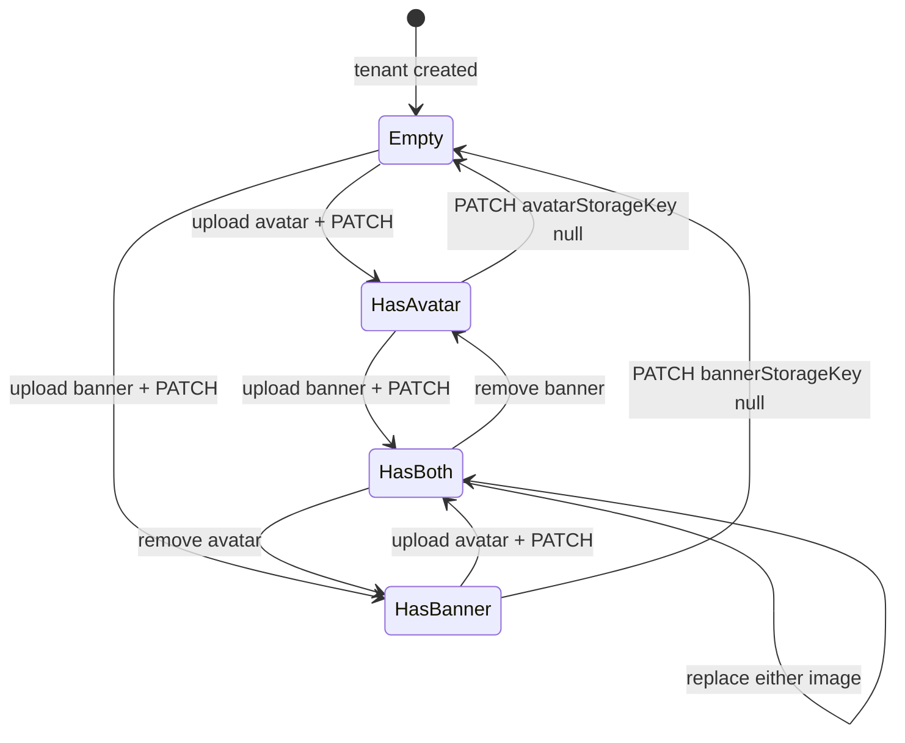

# Data Model: Identidade visual do tenant

**Feature**: 025-tenant-branding-config · **Date**: 2026-06-29

> Migration Prisma em `Tenant`. Labels UI em **PT-BR**; campos API em **inglês**.

## Entidade persistida

### Tenant (alteração)

| Field EN | UI PT-BR | Type | Notes |
|----------|----------|------|-------|
| `id` | — | UUID | PK existente |
| `slug` | — | string | unique |
| `name` | Nome da instituição | string | exibido na boas-vindas |
| `avatarStorageKey` | Foto institucional | string? | nullable; S3 key |
| `bannerStorageKey` | Banner institucional | string? | nullable; S3 key |
| `active` | — | boolean | existente |
| `createdAt` / `updatedAt` | — | DateTime | existentes |

**Storage key pattern** (via `StorageService.buildStorageKey`):

```text
{tenantId}/branding/avatar.{jpg|png}
{tenantId}/branding/banner.{jpg|png}
```

---

## State transitions



- **Replace**: novo presign + PATCH com nova key → delete best-effort da key anterior
- **Read**: presign download URLs efêmeras (~900s); client refetch após mutação

---

## API DTOs

### TenantBrandingResponse (GET)

```typescript
{
  tenantId: string
  name: string
  avatarUrl?: string      // presigned; ausente se avatarStorageKey null
  bannerUrl?: string      // presigned; ausente se bannerStorageKey null
}
```

### UpdateTenantBrandingBody (PATCH)

```typescript
{
  avatarStorageKey?: string | null   // null = remove
  bannerStorageKey?: string | null   // null = remove
}
```

### PresignBrandingBody (POST presign)

```typescript
{
  mimeType: 'image/jpeg' | 'image/png'
}
```

### PresignBrandingResponse

```typescript
{
  uploadUrl: string
  storageKey: string
  expiresIn: number
}
```

---

## Client types (mirror)

```typescript
interface TenantBranding {
  tenantId: string
  name: string
  avatarUrl?: string
  bannerUrl?: string
}
```

---

## Validation rules

| Regra | Camada |
|-------|--------|
| MIME JPEG/PNG only | Zod presign + client file picker |
| Avatar ≤ 5 MB | Client (before upload) |
| Banner ≤ 10 MB | Client (before upload) |
| `storageKey` must match tenant prefix | Use-case update (reject foreign keys) |
| Write only platform admin roles | Controller `@Roles` |

---

## Relacionamentos

- **Tenant** 1 — 0..1 **avatar blob** (S3, via key)
- **Tenant** 1 — 0..1 **banner blob** (S3, via key)
- Sem FK para User; distinto de `User.avatarStorageKey` (perfil pessoal)
