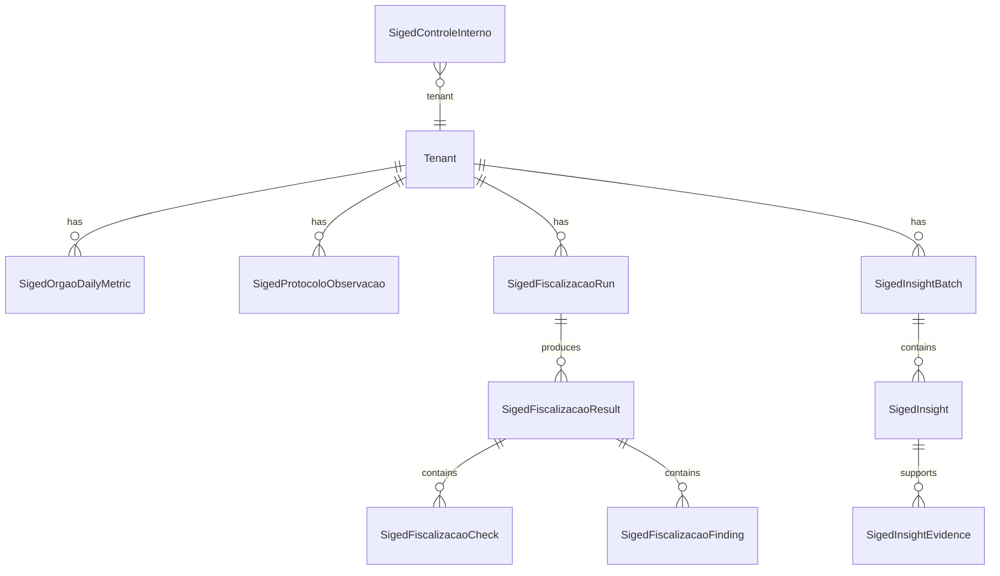

# Data Model — 037 Refactor UX do SIGED

**Spec**: [spec.md](./spec.md) · **Research**: [research.md](./research.md)

Convenções: tenant via AsyncLocalStorage; IDs SIGED (`sigedProtocoloId`, `sigedOrgaoId`) são `Int` espelhando API municipal; entidades v2 usam `uuid` próprio.

## 1. Existentes (sem breaking change)

| Modelo | Arquivo | Papel nesta feature |
| --- | --- | --- |
| `TenantSigedConfig` | `siged.prisma` | Credenciais consulta live |
| `SigedControleInterno` | `siged.prisma` | Anotação Base por protocolo — **inalterado** |

## 2. Histórico local (novo — `siged.prisma`)

### `SigedOrgaoDailyMetric`

Agregado diário por órgão para Home, Cedro e tendências.

| Campo | Tipo | Regras |
| --- | --- | --- |
| `id` | uuid | PK |
| `tenantId` | String | FK Tenant |
| `sigedOrgaoId` | Int | Órgão SIGED |
| `orgaoSigla` | String? | Denormalizado para relatórios |
| `metricDate` | Date | Dia UTC (bucket) |
| `protocolCount` | Int | Protocolos observados no órgão naquele dia |
| `avgDaysInOrgao` | Decimal(8,2)? | Média dias no órgão atual (amostra) |
| `stalledProtocolCount` | Int | Protocolos acima do limite parado (regra TRM-002) |
| `tramitacaoEvents` | Int | Movimentações registradas no dia |
| `collectedAt` | DateTime | Timestamp da coleta |
| `source` | `SigedMetricSource` | `live` \| `historical` |

**Unique**: `@@unique([tenantId, sigedOrgaoId, metricDate])`  
**Index**: `[tenantId, metricDate(sort: Desc)]`

### `SigedProtocoloObservacao`

Último estado conhecido de um protocolo (upsert por protocolo).

| Campo | Tipo | Regras |
| --- | --- | --- |
| `id` | uuid | PK |
| `tenantId` | String | |
| `sigedProtocoloId` | Int | |
| `sigedOrgaoId` | Int | Órgão atual |
| `numero` | String | Número protocolo |
| `situacao` | String? | Snapshot situacao SIGED |
| `lastMovementAt` | DateTime? | Data última movimentação conhecida |
| `daysInCurrentOrgao` | Int? | Calculado na coleta |
| `tramitacaoCount` | Int | Total movimentações vistas |
| `firstSeenAt` | DateTime | |
| `lastSeenAt` | DateTime | Atualizado a cada coleta |

**Unique**: `@@unique([tenantId, sigedProtocoloId])`  
**Index**: `[tenantId, sigedOrgaoId]`, `[tenantId, lastMovementAt]`

### Enum `SigedMetricSource`

`live` | `historical` | `mixed`

---

## 3. Fiscalização SIGED (novo — `siged-fiscalizacao.prisma`)

Espelha `gabinete-fiscalizacao.prisma` com entidade `siged_protocolo`.

### Enums

- `SigedFiscalizedEntityType`: `siged_protocolo` (v1 único valor; extensível)
- Reutiliza globais: `FiscalizacaoRunOrigin`, `FiscalizacaoRunStatus`, `ConformityStatus`, `QuestionAnswerType`, `QuestionAudience`, `QuestionnaireChannel`, `QuestionnaireFlowState`

### `SigedFiscalizacaoRun`

| Campo | Notas |
| --- | --- |
| Contadores | `conformeCount`, `nonConformeCount`, `partialCount`, `pendingCount` |
| `recordsAnalyzed` | Protocolos avaliados na amostra |
| `origin` | `on_demand` \| `scheduled` |
| `dataSourceSummary` | Json opcional — `{ live: n, historical: n }` |

### `SigedFiscalizacaoResult`

| Campo | Notas |
| --- | --- |
| `entityType` | `siged_protocolo` |
| `entityId` | `String(sigedProtocoloId)` |
| `sigedProtocoloId` | Int (denormalizado) |
| `sigedOrgaoId` | Int |
| `protocol` | Número exibível |
| `conformityStatus` | ConformityStatus |
| `fiscalizedDataSummary` | Texto curto |
| `problemsSummary` | Texto curto opcional |

### `SigedFiscalizacaoCheck` / `SigedFiscalizacaoFinding`

Mesma forma Gabinete: `ruleId`, `label`, `tracePayload` Json, ligação finding→check.

### Questionários (somente interno)

- `SigedFiscalizacaoQuestion`
- `SigedFiscalizacaoQuestionnaire` — `sigedProtocoloId`, `sigedOrgaoId`, `channel: portal_interno`
- `SigedFiscalizacaoQuestionnaireItem`
- `SigedFiscalizacaoAnswer`

### `SigedFiscalizacaoSlaConfig` (tenant)

| Campo | Default v1 |
| --- | --- |
| `tramitacaoBusinessDaysLimit` | 2 |
| `stalledCalendarDaysLimit` | 5 |

---

## 4. Insights SIGED (novo — `siged-insights.prisma`)

Espelha `gabinete-insights.prisma`.

### `SigedInsightBatch`

Campos idênticos a Gabinete: `generatedAt`, `origin`, `analysisWindowStart/End`, `status`, `insightCount`.

### `SigedInsight`

Reutiliza enums globais `InsightBatchOrigin`, `InsightBatchStatus`, `InsightImpact`, `InsightCategory` (+ valores SIGED se necessário: `siged_tramitacao`, `siged_volume` — migration additive em enum compartilhado ou `category` string validada Zod).

`sourceLabel`: `"Dados SIGED — consulta integrada"`

### `SigedInsightEvidence`

| Campo | Notas |
| --- | --- |
| `sigedProtocoloId` | Int? |
| `sigedOrgaoId` | Int? |
| `protocol` | Número ou label órgão |
| `snapshotFields` | Json — métricas usadas na regra |

---

## 5. Relacionamentos lógicos (sem FK para SIGED externo)



**Nota**: Não há FK para protocolo SIGED no banco municipal — apenas IDs inteiros + snapshots locais.

---

## 6. DTOs de leitura agregada (API — não persistidos)

### `SigedHomeDto`

```typescript
{
  diretoriasTopLevelCount: number;
  protocolosMonitorados: number;
  lastCollectionAt: string | null;
  sigedLiveAvailable: boolean;
  postIts: Array<{
    kind: 'kpi' | 'jatoba' | 'cedro' | 'empty';
    title: string;
    summary: string;
    impact?: 'Crítico' | 'Alto' | 'Médio';
    href?: string;
    insightId?: string;
  }>;
  licenseAlerts: LicenseAlertChip[]; // regras-plataforma
}
```

### `SigedOrgaoDrilldownDto`

```typescript
{
  orgao: SigedDepartamentoDto;
  ancestors: SigedDepartamentoDto[];
  children: SigedDepartamentoDto[];
  hasOwnProtocolos: boolean; // inferido: orgao listável na API
}
```

---

## 7. Validações e transições

| Regra | Validação |
| --- | --- |
| Snapshot upsert | `metricDate` truncado UTC; upsert idempotente por unique |
| Fiscalização | Run `running` → `completed` \| `failed`; results imutáveis após complete |
| Insights | Throttle 1h por tenant para `on_demand` |
| Controle Interno | Não referencia `ConformityStatus`; permanece `SigedControleStatus` |

---

## 8. Migrações

Ordem sugerida (uma migration ou duas):

1. `siged_history` — métricas + observações
2. `siged_fiscalizacao` — runs/results/checks/findings/questions
3. `siged_insights` — batches/insights/evidences (+ enum category se additive)

Sem alteração destrutiva em `SigedControleInterno` ou `TenantSigedConfig`.
