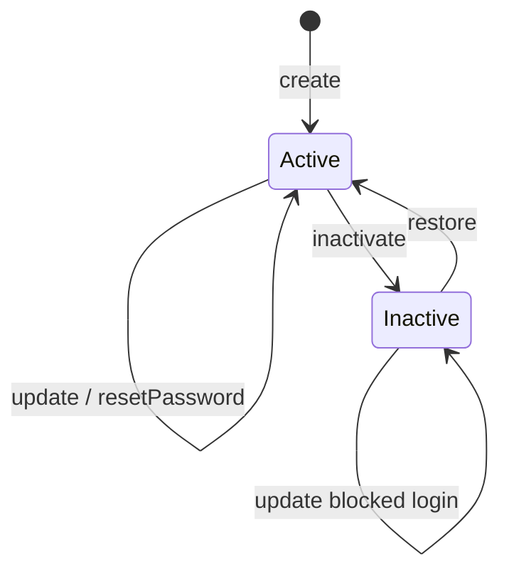
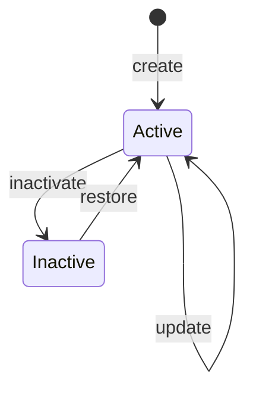

# Data Model: Gestão Institucional — Usuários e Setores

**Feature**: 017-gabinete-usuarios-setores-crud · **Date**: 2026-06-25

> Persistência Prisma existente (`User`, `Setor`, `UserSetor`). Sem migration. Labels UI em **PT-BR**; campos API em **inglês**.

## Entidades persistidas (existentes)

### User

| Field EN | UI PT-BR | Notes |
|----------|----------|-------|
| `id` | — | UUID |
| `tenantId` | — | ALS |
| `email` | E-mail | unique `(tenantId, email)` |
| `name` | Nome | |
| `passwordHash` | — | nunca exposto |
| `role` | Perfil | `user` → Servidor; `chefe_setor` → Chefe de setor |
| `deletedAt` | Status | `null` = Ativo; set = Inativo |
| `userSetores` | Setores | N:N via `UserSetor` |

**Fora do CRUD desta feature**: `role = admin_plataforma`, entidade `AdminTenant`.

### Setor

| Field EN | UI PT-BR | Notes |
|----------|----------|-------|
| `id` | — | UUID |
| `tenantId` | — | ALS |
| `name` | Nome | required |
| `sigla` | Sigla | required; unique lógico por tenant |
| `chefeUserId` | Chefe | optional FK → User |
| `deletedAt` | Status | `null` = Ativo |
| `_count.userSetores` | Membros | derivado |

### UserSetor (junction)

| Field EN | Notes |
|----------|-------|
| `userId` | FK User |
| `setorId` | FK Setor ativo na criação |

---

## State transitions

### User lifecycle



- **Inactivate**: `deletedAt = now()` — login falha (`auth.service` where `deletedAt: null`)
- **Restore**: `deletedAt = null`

### Setor lifecycle



- Setor inativo: excluído de selects em **novo** usuário; vínculos históricos permanecem

---

## Query DTOs (list)

### ListUsersQuery

```typescript
{
  page?: number;      // default 1
  limit?: number;     // default 20, max 100
  q?: string;         // name or email ILIKE
  status?: 'active' | 'inactive' | 'all';  // default 'active'
}
```

### ListSetoresQuery

```typescript
{
  page?: number;
  limit?: number;
  q?: string;         // name or sigla ILIKE
  status?: 'active' | 'inactive' | 'all';
}
```

### PaginatedResponse\<T\>

```typescript
{
  items: T[];
  page: number;
  limit: number;
  total: number;
}
```

---

## Command DTOs

### CreateUserBody

```typescript
{
  email: string;
  name: string;
  password: string;   // min 6
  role: 'user' | 'chefe_setor';
  setorIds: string[]; // min 1, all active setores
}
```

### UpdateUserBody

```typescript
{
  email?: string;
  name?: string;
  role?: 'user' | 'chefe_setor';
  setorIds?: string[];
}
```

### ResetUserPasswordBody

```typescript
{ password: string; }  // min 6
```

### CreateSetorBody / UpdateSetorBody

```typescript
// create
{ name: string; sigla: string; chefeUserId?: string; }

// update (partial)
{ name?: string; sigla?: string; chefeUserId?: string | null; }
```

---

## Response DTOs (list item)

### UserListItem

```typescript
{
  id: string;
  email: string;
  name: string;
  role: 'user' | 'chefe_setor';
  roleLabel: string;           // Servidor | Chefe de setor
  setorIds: string[];
  setorLabels: { id: string; sigla: string; name: string }[];
  status: 'active' | 'inactive';
  statusLabel: string;         // Ativo | Inativo
  isChiefOfSetorIds: string[]; // setores onde user é chefe via Setor.chefeUserId
}
```

### SetorListItem

```typescript
{
  id: string;
  sigla: string;
  name: string;
  chefeUserId: string | null;
  chefeName: string | null;
  memberCount: number;
  status: 'active' | 'inactive';
  statusLabel: string;
}
```

---

## KPI stats (client-derived from list totals or dedicated counts)

### UsersAdminStats

| Label UI | Source |
|----------|--------|
| Total de usuários | `total` with status=all |
| Ativos | count active |
| Inativos | count inactive |
| Chefias | items where role=chefe_setor (active filter) |

### SetoresAdminStats

| Label UI | Source |
|----------|--------|
| Total de setores | total all |
| Ativos | active count |
| Inativos | inactive count |
| Sem chefe designado | active without chefeUserId |

> KPIs são **operacionais Base** — não licenças premium.

---

## Validation rules (use-case)

| Rule | Error |
|------|-------|
| Email dup (tenant) | 409 Conflict |
| Sigla dup (tenant, CI) | 409 Conflict |
| setorIds includes inactive setor on create/update | 400 Bad Request |
| role not in allowlist | 400 Bad Request |
| inactivate self | 403 Forbidden |
| inactivate last institutional admin | 403 Forbidden |
| restore with email conflict | 409 Conflict |
| chefeUserId points to inactive user | 400 Bad Request |

---

## Client screen registry

| screenId | path | module |
|----------|------|--------|
| `gabinete-usuarios` | `/gabinete/usuarios` | `gabinete` |
| `gabinete-setores` | `/gabinete/setores` | `gabinete` |
| `admin-plataforma-usuarios` | `/administracao/plataforma/usuarios` | `administracao` |
| `admin-plataforma-setores` | `/administracao/plataforma/setores` | `administracao` |

All: `licenses: ['base']`, `type: 'admin'`, no premium stats in screen config.
