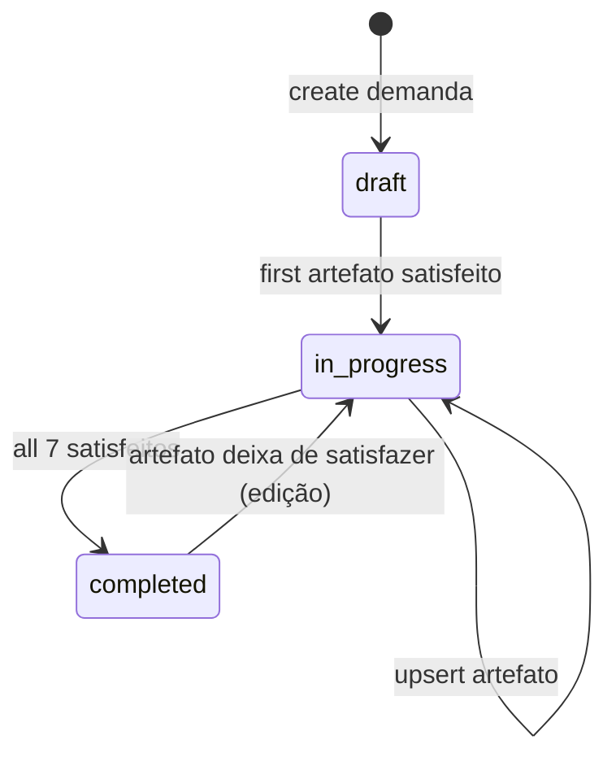

# Data Model: Purchasing — CRUD de Demandas e Artefatos

**Feature**: 018-purchasing-crud · **Date**: 2026-06-25

> Campos Prisma/API em **inglês**; labels UI em **PT-BR** via `compras.mapper.ts`. Soft delete via extension Prisma (`deletedAt`). Tenant via ALS — **nunca** passar `tenantId` manualmente nos use-cases.

## Enums

### `CompraPcaStatus`

| Value | UI PT-BR |
|-------|----------|
| `active` | Ativo |
| `closed` | Encerrado |

### `CompraArtefatoState` (derivado — não persistido)

| Value | UI PT-BR | Condição |
|-------|----------|----------|
| `filled` | Preenchido | Registro completo |
| `pending` | Pendente | Ausente ou incompleto |
| `waived` | Dispensado | Apenas ETP com dispensa válida |

### `CompraDemandaStatus` (derivado — não persistido)

| Value | UI PT-BR | Condição |
|-------|----------|----------|
| `draft` | Rascunho | 0 artefatos satisfeitos |
| `in_progress` | Em andamento | 1–6 satisfeitos |
| `completed` | Concluído | 7 satisfeitos |

---

## CompraPca

Plano de Contratações Anual — agrupador 1:N de demandas.

| Field EN | UI PT-BR | Required | Notes |
|----------|----------|----------|-------|
| `id` | — | yes | UUID |
| `tenantId` | — | yes | |
| `title` | Título | yes | VarChar 200 |
| `description` | Descrição | no | Text |
| `status` | Status | yes | enum `CompraPcaStatus`, default `active` |
| audit | — | yes | created/updated/deleted |

**Relations**: `demandas CompraDemanda[]`

**Rules**:

- PCA encerrado (`closed`) **não** aparece em seletor de nova demanda (FR-022)
- Encerrar PCA **não** desvincula demandas existentes (FR-023)
- Reativação de PCA encerrado — **fora de escopo**

---

## CompraDemandaSequence

| Field EN | Required |
|----------|----------|
| `tenantId` | yes |
| `nextNumber` | yes | default 1 |

Unique `(tenantId)`.

---

## CompraDemanda

Unidade de instrução processual (UI: **demanda**).

| Field EN | UI PT-BR | Required | Notes |
|----------|----------|----------|-------|
| `id` | — | yes | UUID |
| `tenantId` | — | yes | |
| `number` | Número | yes | Int sequencial; unique `(tenantId, number)` |
| `title` | Título | yes | VarChar 300 |
| `object` | Objeto | yes | Text |
| `pcaId` | PCA | yes | FK → `CompraPca` — **non-nullable** (FR-004) |
| `sectorId` | Setor responsável | no | FK → `Setor` |
| audit | — | yes | |

**Relations** (1:1 cada): `dfd`, `etp`, `riskAnalysis`, `termsOfReference`, `priceSurvey`, `budgetAllocation`, `legalOpinion`

**Derived (mapper)**:

- `status` → `CompraDemandaStatus`
- `progress` → `{ satisfied: number, total: 7, label: "3/7 preenchidos" }`
- `checklist` → array de 7 itens com `CompraArtefatoState`

**Rules**:

- Soft-deleted demandas **não** aparecem na listagem (edge case spec)
- Acesso cross-tenant → 404 (FR-030)

---

## CompraDfd

Documento de Formalização de Demanda — 1:1 `demandaId` unique.

| Field EN | UI PT-BR | Required | Notes |
|----------|----------|----------|-------|
| `demandaId` | — | yes | FK unique |
| `need` | Necessidade | yes | Text (FR-010) |
| `justification` | Justificativa | yes | Text |
| `contractObject` | Objeto da contratação | yes | Text |
| `demandEstimate` | Estimativa de demanda | yes | Text |
| `needDeadline` | Prazo de necessidade | yes | String ou Date |
| `storageKey` | Comprovante | no | Wasabi |
| `comprovanteFileName` | — | no | |
| `comprovanteMimeType` | — | no | |
| audit | — | yes | |

---

## CompraEtp

Estudo Técnico Preliminar — 1:1 unique.

| Field EN | UI PT-BR | Required | Notes |
|----------|----------|----------|-------|
| `demandaId` | — | yes | FK unique |
| `waived` | Dispensado | yes | Boolean default false |
| `waiverReason` | Motivo da dispensa | if waived | Text |
| `solutionDescription` | Descrição da solução | if !waived | Text |
| `viabilityAnalysis` | Análise de viabilidade | if !waived | Text |
| `costEstimate` | Estimativa de custos | no | Decimal optional |
| `storageKey` | Comprovante | no | |
| comprovante meta | — | no | fileName, mimeType |
| audit | — | yes | |

**Validation (Zod)**:

- `waived=true` → exige `waiverReason`; campos técnicos opcionais
- `waived=false` → exige `solutionDescription`, `viabilityAnalysis`

---

## CompraAnaliseRiscos

| Field EN | UI PT-BR | Required | Notes |
|----------|----------|----------|-------|
| `demandaId` | — | yes | FK unique |
| `risks` | Riscos | yes | JSON array — ver abaixo |
| `storageKey` | Comprovante | no | |
| comprovante meta | — | no | |
| audit | — | yes | |

**Risk item shape**:

```typescript
{
  description: string;      // descrição
  probability: string;      // probabilidade (enum ou texto curto)
  impact: string;           // impacto
  mitigation: string;       // mitigação
}
```

**Rules**: lista vazia → artefato **Pendente** (edge case spec).

---

## CompraTermoReferencia

| Field EN | UI PT-BR | Required | Notes |
|----------|----------|----------|-------|
| `demandaId` | — | yes | FK unique |
| `detailedObject` | Objeto detalhado | yes | Text |
| `technicalSpecifications` | Especificações técnicas | yes | Text |
| `acceptanceCriteria` | Critérios de aceitação | no | Text |
| `storageKey` | Comprovante | no | |
| comprovante meta | — | no | |
| audit | — | yes | |

---

## CompraPesquisaPrecos

| Field EN | UI PT-BR | Required | Notes |
|----------|----------|----------|-------|
| `demandaId` | — | yes | FK unique |
| `estimatedValue` | Valor estimado | yes | Decimal > 0 (FR-013) |
| `surveySource` | Fonte da pesquisa | yes | Text |
| `storageKey` | Comprovante | no | |
| comprovante meta | — | no | |
| audit | — | yes | |

---

## CompraDotacaoOrcamentaria

| Field EN | UI PT-BR | Required | Notes |
|----------|----------|----------|-------|
| `demandaId` | — | yes | FK unique |
| `expenseNature` | Natureza de despesa | yes | String |
| `workProgram` | Programa de trabalho | yes | String |
| `fundingSource` | Fonte de recurso | yes | String |
| `allocatedValue` | Valor dotado | yes | Decimal > 0 |
| `storageKey` | Comprovante | no | |
| comprovante meta | — | no | |
| audit | — | yes | |

---

## CompraParecerJuridico

| Field EN | UI PT-BR | Required | Notes |
|----------|----------|----------|-------|
| `demandaId` | — | yes | FK unique |
| `opinionText` | Texto do parecer | yes | Text |
| `documentNumber` | Número do documento | no | String |
| `issuedAt` | Data de emissão | no | DateTime |
| `storageKey` | Comprovante | no | |
| comprovante meta | — | no | |
| audit | — | yes | |

---

## Checklist artefatos (ordem UI fixa, preenchimento livre)

| Key | Rota client | Rota API suffix | Label UI |
|-----|-------------|-----------------|----------|
| `dfd` | `/dfd` | `dfd` | DFD |
| `etp` | `/etp` | `etp` | ETP |
| `analise-riscos` | `/analise-riscos` | `analise-riscos` | Análise de Riscos |
| `tr` | `/tr` | `tr` | Termo de Referência |
| `pesquisa-precos` | `/pesquisa-precos` | `pesquisa-precos` | Pesquisa de Preços |
| `dotacao` | `/dotacao` | `dotacao-orcamentaria` | Dotação Orçamentária |
| `parecer` | `/parecer` | `parecer-juridico` | Parecer Jurídico |

---

## DTOs de listagem

### `ListDemandasQuery`

| Param | Type | Default |
|-------|------|---------|
| `page` | int | 1 |
| `limit` | int | 20 (max 100) |
| `pcaId` | uuid | optional |
| `status` | `draft \| in_progress \| completed` | optional |

### `ListDemandasItem`

```typescript
{
  id: string;
  number: number;
  title: string;
  object: string;          // truncated preview
  pca: { id: string; title: string };
  status: CompraDemandaStatus;
  progress: { satisfied: number; total: 7; label: string };
}
```

### `DemandaDetailResponse`

Demanda + `checklist[]` + artefato payloads nullable + PCA + setor opcional.

---

## State transitions (demanda status — derivado)



Transições automáticas a cada upsert de artefato — **sem** endpoint PATCH de status.
