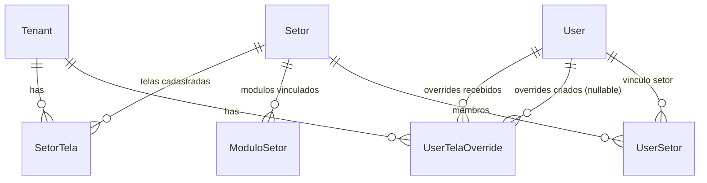

# Data Model: Sistema de Permissão de Telas

**Feature**: [spec.md](./spec.md) · **Research**: [research.md](./research.md)

## Entidades novas (Prisma)

Novo arquivo: `ci-api-v2/prisma/schema/tela-permissao.prisma`

### SetorTela

Vínculo N:N entre `Setor` e uma tela do catálogo (`screenId` livre, validado em runtime).

| Campo | Tipo | Notas |
|-------|------|-------|
| `id` | `String @id @default(uuid())` | |
| `tenantId` | `String` | FK `Tenant` |
| `setorId` | `String` | FK `Setor`, `onDelete: Cascade` |
| `screenId` | `String` | Validado contra `SCREEN_CATALOG` em runtime (não FK) |
| `createdAt` | `DateTime @default(now())` | |

**Constraints**: `@@unique([tenantId, setorId, screenId])`, `@@index([tenantId, setorId])`

**Regra de negócio**: Ausência de qualquer linha para um `setorId` → visibilidade cai para baseline derivada de `ModuloSetor` (FR-007). Presença de ao menos 1 linha → a lista explícita é a fonte de verdade (mesmo que incompleta).

### UserTelaOverride

Exceção individual — grant (libera) ou deny (restringe) uma tela para um usuário, sobrepondo a visibilidade derivada do(s) setor(es).

| Campo | Tipo | Notas |
|-------|------|-------|
| `id` | `String @id @default(uuid())` | |
| `tenantId` | `String` | FK `Tenant` |
| `userId` | `String` | FK `User` (alvo do override), `onDelete: Cascade` |
| `screenId` | `String` | Validado contra `SCREEN_CATALOG` |
| `kind` | `TelaOverrideKind` (`grant` \| `deny`) | |
| `createdByUserId` | `String?` | Nullable — ator pode ser `admin_tenant` (regra `admin-tenant-user-fk`) |
| `createdAt` | `DateTime @default(now())` | |

**Constraints**: `@@unique([tenantId, userId, screenId])` — um único override ativo por (usuário, tela); trocar de `grant` para `deny` substitui a linha (upsert). `@@index([tenantId, userId])`

**Novo enum** (`ci-api-v2/prisma/schema/enums.prisma`):

```prisma
enum TelaOverrideKind {
  grant
  deny
}
```

## Relações a adicionar em modelos existentes

- `Setor` (`setor.prisma`): `setorTelas SetorTela[]`
- `User` (`user.prisma`): `telaOverridesRecebidos UserTelaOverride[] @relation("UserTelaOverrideTarget")`, `telaOverridesCriados UserTelaOverride[] @relation("UserTelaOverrideCreatedBy")`
- `Tenant` (`tenant.prisma`): `setorTelas SetorTela[]`, `userTelaOverrides UserTelaOverride[]`

## Entidade não-persistida: Screen (catálogo)

Não é uma tabela — constante versionada no código da API.

**Local**: `ci-api-v2/src/common/constants/screens.ts`

```typescript
export interface ScreenCatalogEntry {
  id: string
  title: string
  moduloSlug: ModuloSlug
  /** Telas sempre visíveis a quem tem determinado papel, independente de SetorTela. */
  scope?: 'platform' | 'chefia'
}

export const SCREEN_CATALOG: ScreenCatalogEntry[] = [ /* ~80-100 entradas, espelha screens.ts do client */ ]

export function isScreenId(value: string): boolean
export function getScreenCatalogEntry(id: string): ScreenCatalogEntry | undefined
```

**Validação de negócio**:
- `scope: 'platform'` → tela só aparece para `admin_plataforma`/`admin_tenant`/`admin_saas` (bypass já cobre isso — na prática nunca aparece para não-admin mesmo com override `grant`, exceto se explicitamente permitido — **decisão**: overrides NÃO podem contornar `scope: 'platform'`; API rejeita `grant` nessas telas com 400).
- `scope: 'chefia'` → tela é adicionada automaticamente se `chiefOfSetorIds.length > 0`; overrides `grant`/`deny` funcionam normalmente para quem não é/é chefe.
- Sem `scope` → tela de negócio, visibilidade 100% derivada de `SetorTela`/baseline + overrides.

## Algoritmo: visibilidade efetiva de um usuário

Entrada: `userId`, `role`, `setorIds[]`, `chiefOfSetorIds[]`.

```text
SE role ∈ {admin_plataforma, admin_tenant, admin_saas}:
  RETORNA todas as telas do catálogo

setorScreens := ∅
PARA CADA setorId EM setorIds:
  linhas := SetorTela WHERE setorId = setorId
  SE linhas não vazio:
    setorScreens += screenId de cada linha
  SENÃO:
    moduloIds := ModuloSetor WHERE setorId = setorId
    setorScreens += telas do catálogo cujo moduloSlug ∈ moduloIds

openScreens := telas do catálogo cujo moduloSlug ∈ OPEN_MODULES (global, tramitacao)

chefiaScreens := SE chiefOfSetorIds não vazio
                  ENTÃO telas do catálogo com scope = 'chefia'
                  SENÃO ∅

base := setorScreens ∪ openScreens ∪ chefiaScreens

overrides := UserTelaOverride WHERE userId = userId
grants := screenId de overrides WHERE kind = 'grant' E scope da tela ≠ 'platform'
denies := screenId de overrides WHERE kind = 'deny'

RESULTADO := (base ∪ grants) − denies
```

## Detecção de conflitos (US2)

Para um usuário com `setorIds` não vazio, comparar a visibilidade **derivada de setor+role** (sem overrides aplicados) contra a visibilidade que ele **efetivamente teria hoje via role puro** (equivalente ao `userVisible` do mock) — mantém a semântica atual:

- **`exceeds_sector`**: tela em `userVisible` (calculado por role/chefia/bypass, SEM olhar setor) mas NÃO em `setorScreens`.
- **`below_sector`**: tela em `setorScreens` mas NÃO em `userVisible`.

Conflitos com override já confirmado (`grant` resolve `below_sector`; `deny` resolve `exceeds_sector`, ou `grant` explícito documenta um `exceeds_sector` aceito) são excluídos da lista de pendências — mesma lógica de `hasOverride()` do mock (`navigation-visibility-validation.ts`), agora lendo de `UserTelaOverride` em vez de estado em memória.

## Diagrama de relações


