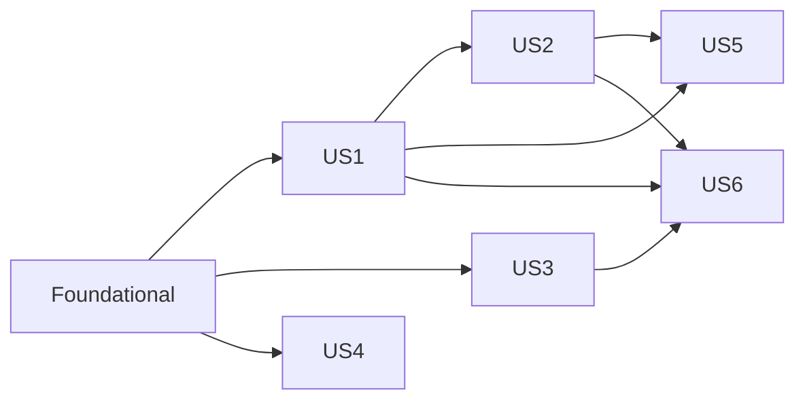

# Tasks: Sistema de Permissão de Telas e De-mock Navegação

**Input**: Design documents from `civ2-docs/specs/032-permission-screen-visibility/`

**Prerequisites**: plan.md, spec.md, research.md, data-model.md, contracts/api-contracts.md, quickstart.md

**Tests**: **Obrigatórios** — TDD (constitution II, NON-NEGOTIABLE): RED → GREEN → REFACTOR. Todo use-case, repository e controller novo tem teste correspondente escrito e falhando antes da implementação. Skills: `tdd`, `testing-conventions` (API/Jest), `js-ts-data-transforms` (client/Vitest).

**Organization**: US1, US2 e US3 são P1 (US3 é pré-requisito técnico de US1/US2 — catálogo de telas); US4 e US5 são P2; US6 é P3. Caminhos relativos à raiz `ci-v2/`. Módulos API `setor` e `permissao` **já existem** — tasks **estendem** `setor.controller.ts`/`setor.module.ts` e criam o módulo novo `tela-permissao/`.

## Format: `[ID] [P?] [Story] Description`

- **[P]**: Pode executar em paralelo (arquivos diferentes, sem dependências pendentes)
- **[Story]**: User story da spec (US1–US6)

---

## Phase 1: Setup (Shared Infrastructure)

**Purpose**: Fixtures, handlers MSW e esqueleto de pastas para permitir TDD desde o primeiro teste

- [X] T001 [P] Criar fixtures API em `ci-api-v2/src/modules/tela-permissao/test/fixtures/screen-catalog.json`, `setor-telas-response.json`, `user-tela-overrides-response.json` conforme `data-model.md`
- [X] T002 [P] Criar fixtures client em `ci-client-v2/apps/web/src/modules/permissao/fixtures/screen-catalog.json`, `setor-telas.json`, `user-tela-overrides.json`, `user-tela-conflicts.json`
- [X] T003 [P] Implementar handlers MSW em `ci-client-v2/apps/web/src/test/msw/handlers/permission-screens.ts` — `GET /screens`, `GET/PUT /setores/:id/telas`, `GET/PUT /users/:id/tela-overrides`, `GET /users/:id/tela-conflicts`, `GET /me/screens`, `POST/DELETE /setores/:id/membros*`; registrar em `ci-client-v2/apps/web/src/test/msw/handlers.ts`
- [X] T004 [P] Criar pasta `ci-api-v2/src/modules/tela-permissao/` com subpastas `repository/` e `use-cases/`; `tela-permissao.module.ts` stub (`providers: []`) ainda não registrado em `app.module.ts`

---

## Phase 2: Foundational (Blocking Prerequisites)

**Purpose**: Schema Prisma, catálogo de telas e esqueleto do módulo — **bloqueia todas as user stories**

**⚠️ CRITICAL**: Nenhuma user story começa antes desta fase

### Tests first (TDD — RED)

- [X] T005 [P] Escrever teste (RED) `ci-api-v2/src/common/constants/screens.spec.ts` — `isScreenId()` aceita/rejeita ids, `getScreenCatalogEntry()` retorna `scope` correto para telas `platform`/`chefia`/sem scope

### Schema e migration

- [X] T006 Criar `ci-api-v2/prisma/schema/tela-permissao.prisma` com models `SetorTela` e `UserTelaOverride` (ver `data-model.md`)
- [X] T007 Adicionar `enum TelaOverrideKind { grant deny }` em `ci-api-v2/prisma/schema/enums.prisma`
- [X] T008 [P] Adicionar relation `setorTelas SetorTela[]` em `ci-api-v2/prisma/schema/setor.prisma`
- [X] T009 [P] Adicionar relations `telaOverridesRecebidos`/`telaOverridesCriados UserTelaOverride[]` em `ci-api-v2/prisma/schema/user.prisma`
- [X] T010 [P] Adicionar relations `setorTelas`/`userTelaOverrides` em `ci-api-v2/prisma/schema/tenant.prisma`
- [X] T011 Rodar `npx prisma migrate dev --name add_tela_permissao` e `npx prisma generate` em `ci-api-v2/`

### Catálogo e esqueleto do módulo

- [X] T012 [P] Implementar `ci-api-v2/src/common/constants/screens.ts` — `SCREEN_CATALOG: ScreenCatalogEntry[]` (extraído de `ci-client-v2/apps/web/src/modules/shell/config/screens.ts` + `scope` derivado de `navigation.ts` `adminScope`), `isScreenId()`, `getScreenCatalogEntry()` (GREEN T005)
- [X] T013 Criar `ci-api-v2/src/modules/tela-permissao/tela-permissao.module.ts` e registrar em `ci-api-v2/src/app.module.ts` (imports: `PermissaoModule`)
- [X] T014 [P] Criar `ci-api-v2/src/modules/tela-permissao/tela-permissao.types.ts` — `EffectiveScreensResult`, `SetorTelaResult`, `UserTelaOverrideDto`, `TelaConflict`
- [X] T015 [P] Criar `ci-api-v2/src/modules/tela-permissao/tela-permissao.schemas.ts` — `replaceSetorTelasSchema`, `replaceUserTelaOverridesSchema` (Zod, `screenId` validado via `isScreenId` com `.refine`)
- [X] T016 Criar `ci-api-v2/src/modules/tela-permissao/tela-permissao.controller.ts` vazio (`@Controller()`) registrado no módulo, sem rotas ainda

**Checkpoint**: Migration aplicada; catálogo GREEN; módulo registrado e injetável — user stories podem começar

---

## Phase 3: User Story 1 — Admin configura visibilidade de telas por setor (Priority: P1) 🎯 MVP

**Goal**: `GET/PUT /setores/:id/telas` funcionando com baseline derivada de `ModuloSetor`; painel admin no modo "Por setor" consumindo API real

**Independent Test**: Criar setor sem config → `GET /setores/:id/telas` retorna `source: "baseline"` com telas dos módulos vinculados; `PUT` com nova lista → `GET` subsequente retorna `source: "explicit"`

### Tests for User Story 1 (TDD — RED first)

- [X] T017 [P] [US1] Escrever teste (RED) `ci-api-v2/src/modules/tela-permissao/repository/find-setor-telas.repository.spec.ts`
- [X] T018 [P] [US1] Escrever teste (RED) `ci-api-v2/src/modules/tela-permissao/repository/replace-setor-telas.repository.spec.ts`
- [X] T019 [P] [US1] Escrever teste (RED) `ci-api-v2/src/modules/tela-permissao/use-cases/get-setor-telas.use-case.spec.ts` — retorna `explicit` quando há linhas, `baseline` (via `ModuloSetor`) quando vazio
- [X] T020 [P] [US1] Escrever teste (RED) `ci-api-v2/src/modules/tela-permissao/use-cases/replace-setor-telas.use-case.spec.ts` — 400 quando `screenIds` contém id inválido
- [X] T021 [P] [US1] Escrever teste (RED) `ci-api-v2/src/modules/tela-permissao/tela-permissao.controller.spec.ts` — `GET/PUT /setores/:id/telas` 200 para `admin_tenant`/`admin_plataforma`, 403 para `user`/`chefe_setor`
- [X] T022 [P] [US1] Escrever teste (RED) `ci-client-v2/apps/web/src/modules/shell/lib/__tests__/navigation-sector-presets.test.ts` — consumindo fixtures MSW de `fetchSetorTelas`/`fetchScreenCatalog`

### Implementation for User Story 1

- [X] T023 [P] [US1] Implementar `ci-api-v2/src/modules/tela-permissao/repository/find-setor-telas.repository.ts` (GREEN T017)
- [X] T024 [P] [US1] Implementar `ci-api-v2/src/modules/tela-permissao/repository/replace-setor-telas.repository.ts` — transação delete+createMany (GREEN T018)
- [X] T025 [US1] Implementar `ci-api-v2/src/modules/tela-permissao/use-cases/get-setor-telas.use-case.ts` — fallback baseline via `FindModuloSetores`/`ModuloSetor` (GREEN T019, depende de T023)
- [X] T026 [US1] Implementar `ci-api-v2/src/modules/tela-permissao/use-cases/replace-setor-telas.use-case.ts` — valida `isScreenId` antes de persistir (GREEN T020, depende de T024)
- [X] T027 [US1] Adicionar rotas `GET/PUT /setores/:id/telas` em `ci-api-v2/src/modules/tela-permissao/tela-permissao.controller.ts` com `@Roles(UserRole.admin_tenant)` (GREEN T021)
- [X] T028 [US1] Registrar `FindSetorTelasRepository`, `ReplaceSetorTelasRepository`, `GetSetorTelasUseCase`, `ReplaceSetorTelasUseCase` em `tela-permissao.module.ts`
- [X] T029 [P] [US1] Criar `ci-client-v2/apps/web/src/modules/permissao/api/telas.ts` — `fetchSetorTelas(setorId)`, `replaceSetorTelas(setorId, screenIds)`
- [X] T030 [US1] De-mockar `ci-client-v2/apps/web/src/modules/shell/lib/navigation-sector-presets.ts` — substituir `moduleSectorLinks`/`adminSectors` locais por `fetchSetorTelas`/`fetchSetores` (GREEN T022)
- [X] T031 [US1] Atualizar `ci-client-v2/apps/web/src/modules/shell/components/mock/NavigationVisibilityPanel.tsx` modo "Por setor" — estado assíncrono (loading/error) ao trocar de setor e ao salvar toggles
- [X] T032 [US1] Atualizar `ci-client-v2/apps/web/src/modules/shell/components/mock/MockSectorPicker.tsx` — consumir `fetchSetores()` real em vez de `adminSectors`

**Checkpoint**: US1 completo — admin configura telas por setor via API real, com baseline automática

---

## Phase 4: User Story 2 — Admin gerencia exceções por usuário (Priority: P1)

**Goal**: `GET/PUT /users/:id/tela-overrides` + `GET /users/:id/tela-conflicts` persistidos; diálogo de conflito e badges do painel consumindo API

**Independent Test**: Usuário com conflito pendente → `GET /users/:id/tela-conflicts` retorna item; `PUT /users/:id/tela-overrides` com `grant`/`deny` → conflito correspondente desaparece da lista subsequente

### Tests for User Story 2 (TDD — RED first)

- [X] T033 [P] [US2] Escrever teste (RED) `ci-api-v2/src/modules/tela-permissao/repository/find-user-tela-overrides.repository.spec.ts`
- [X] T034 [P] [US2] Escrever teste (RED) `ci-api-v2/src/modules/tela-permissao/repository/replace-user-tela-overrides.repository.spec.ts` — upsert idempotente por `screenId`
- [X] T035 [P] [US2] Escrever teste (RED) `ci-api-v2/src/modules/tela-permissao/use-cases/get-user-tela-overrides.use-case.spec.ts`
- [X] T036 [P] [US2] Escrever teste (RED) `ci-api-v2/src/modules/tela-permissao/use-cases/replace-user-tela-overrides.use-case.spec.ts` — 400 `PLATFORM_SCREEN_NOT_OVERRIDABLE` ao tentar `grant` em tela `scope: platform`
- [X] T037 [P] [US2] Escrever teste (RED) `ci-api-v2/src/modules/tela-permissao/use-cases/detect-user-tela-conflicts.use-case.spec.ts` — casos `exceeds_sector`, `below_sector`, e exclusão de conflitos já resolvidos por override
- [X] T038 [P] [US2] Escrever teste (RED) `ci-api-v2/src/modules/tela-permissao/tela-permissao.controller.spec.ts` — rotas de overrides/conflicts, 403 para não-admin
- [X] T039 [P] [US2] Escrever teste (RED) `ci-client-v2/apps/web/src/modules/shell/components/mock/__tests__/UserSectorConflictDialog.test.tsx` — confirmar individual/lote chama `replaceUserTelaOverrides`

### Implementation for User Story 2

- [X] T040 [P] [US2] Implementar `ci-api-v2/src/modules/tela-permissao/repository/find-user-tela-overrides.repository.ts` (GREEN T033)
- [X] T041 [P] [US2] Implementar `ci-api-v2/src/modules/tela-permissao/repository/replace-user-tela-overrides.repository.ts` (GREEN T034)
- [X] T042 [US2] Implementar `ci-api-v2/src/modules/tela-permissao/use-cases/get-user-tela-overrides.use-case.ts` (GREEN T035, depende de T040)
- [X] T043 [US2] Implementar `ci-api-v2/src/modules/tela-permissao/use-cases/replace-user-tela-overrides.use-case.ts` — valida `scope` antes de `grant` (GREEN T036, depende de T041)
- [X] T044 [US2] Implementar `ci-api-v2/src/modules/tela-permissao/use-cases/detect-user-tela-conflicts.use-case.ts` — reusa `GetSetorTelasUseCase` (baseline/explicit) + visibilidade role-only (GREEN T037, depende de T025)
- [X] T045 [US2] Adicionar rotas `GET/PUT /users/:id/tela-overrides`, `GET /users/:id/tela-conflicts` em `tela-permissao.controller.ts` com `@Roles(UserRole.admin_tenant)` (GREEN T038); registrar providers em `tela-permissao.module.ts`
- [X] T046 [P] [US2] Estender `ci-client-v2/apps/web/src/modules/permissao/api/telas.ts` — `fetchUserTelaOverrides`, `replaceUserTelaOverrides`, `fetchUserTelaConflicts`
- [X] T047 [US2] De-mockar `ci-client-v2/apps/web/src/modules/shell/lib/navigation-visibility-validation.ts` — `detectSectorUserConflicts`/`mergeOverrides` passam a chamar a API em vez de operar em estado local
- [X] T048 [US2] Atualizar `NavigationVisibilityPanel.tsx` modo "Por usuário" — overrides persistidos via API (loading ao trocar de usuário, refetch pós-confirmação)
- [X] T049 [US2] Atualizar `ci-client-v2/apps/web/src/modules/shell/components/mock/UserSectorConflictDialog.tsx` — `onConfirmAll`/`onConfirmOne` chamam `replaceUserTelaOverrides` (GREEN T039)
- [X] T050 [US2] Atualizar `ci-client-v2/apps/web/src/modules/shell/components/mock/MockUserPicker.tsx` — badges de exceção/conflito lendo contagem via API

**Checkpoint**: US2 completo — exceções bidirecionais persistidas e refletidas no painel

---

## Phase 5: User Story 3 — Catálogo de telas na API (Priority: P1)

**Goal**: `GET /screens` expõe o catálogo completo; painel monta a grade a partir da API em vez de `navigation.ts` local para fins de permissão

**Independent Test**: `GET /screens` retorna todas as telas com `scope` correto; `PUT /setores/:id/telas` com screenId inexistente retorna 400 com `invalidScreenIds`

### Tests for User Story 3 (TDD — RED first)

- [X] T051 [P] [US3] Escrever teste (RED) `ci-api-v2/src/modules/tela-permissao/use-cases/list-screens.use-case.spec.ts`
- [X] T052 [P] [US3] Escrever teste (RED) `ci-api-v2/src/modules/tela-permissao/tela-permissao.controller.spec.ts` — `GET /screens` 200 para qualquer autenticado, shape `{ items: [...] }`
- [X] T053 [P] [US3] Escrever teste (RED) `ci-client-v2/apps/web/src/modules/permissao/api/__tests__/telas.test.ts` — `fetchScreenCatalog()`

### Implementation for User Story 3

- [X] T054 [US3] Implementar `ci-api-v2/src/modules/tela-permissao/use-cases/list-screens.use-case.ts` (GREEN T051)
- [X] T055 [US3] Adicionar rota `GET /screens` em `tela-permissao.controller.ts`, sem `@Roles` (qualquer autenticado) (GREEN T052)
- [X] T056 [P] [US3] Estender `telas.ts` — `fetchScreenCatalog()` (GREEN T053)
- [X] T057 [US3] Atualizar `NavigationVisibilityPanel.tsx` — montar lista de telas da grade a partir de `fetchScreenCatalog()`; `navigation.ts`/`screens.ts` locais passam a ser usados só para layout/ícones/rotas, não para decidir permissão

**Checkpoint**: US3 completo — catálogo é fonte única de verdade para validação de screenId

---

## Phase 6: User Story 4 — CRUD completo de membros do setor (Priority: P2)

**Goal**: Vincular/desvincular/criar membro via API real em `/administracao/membros`

**Independent Test**: Fluxo quickstart §4 — vincular usuário existente → aparece na lista; criar novo usuário vinculado → aparece; desvincular não-chefe → some; desvincular chefe → 400; chefe de outro setor → 403

### Tests for User Story 4 (TDD — RED first)

- [X] T058 [P] [US4] Escrever teste (RED) `ci-api-v2/src/modules/setor/use-cases/link-user-to-setor.use-case.spec.ts` — idempotente se já vinculado
- [X] T059 [P] [US4] Escrever teste (RED) `ci-api-v2/src/modules/setor/use-cases/unlink-user-from-setor.use-case.spec.ts` — 400 `CANNOT_UNLINK_CHIEF` quando `userId === setor.chefeUserId`
- [X] T060 [P] [US4] Escrever teste (RED) `ci-api-v2/src/modules/setor/setor.controller.spec.ts` — `POST/DELETE /setores/:id/membros*`, 403 para chefe de setor diferente, 200/201 para admin
- [X] T061 [P] [US4] Escrever teste (RED) `ci-client-v2/apps/web/src/modules/setor/components/__tests__/SectorMembersPanel.crud.test.tsx` — vincular/criar/desvincular via MSW

### Implementation for User Story 4

- [X] T062 [P] [US4] Implementar `ci-api-v2/src/modules/setor/use-cases/link-user-to-setor.use-case.ts` (GREEN T058)
- [X] T063 [P] [US4] Implementar `ci-api-v2/src/modules/setor/use-cases/unlink-user-from-setor.use-case.ts` (GREEN T059)
- [X] T064 [US4] Adicionar rotas `POST /setores/:id/membros`, `DELETE /setores/:id/membros/:userId`, `POST /setores/:id/membros/create-user` em `ci-api-v2/src/modules/setor/setor.controller.ts` reusando `assertChefiaOrAdmin` (GREEN T060); `create-user` delega para `CreateUserUseCase` fixando `setorIds: [id]`
- [X] T065 [US4] Registrar `LinkUserToSetorUseCase`, `UnlinkUserFromSetorUseCase` em `ci-api-v2/src/modules/setor/setor.module.ts`
- [X] T066 [P] [US4] Estender `ci-client-v2/apps/web/src/modules/setor/api/setores.ts` — `linkMember(setorId, userId)`, `unlinkMember(setorId, userId)`, `createMemberUser(setorId, body)`
- [X] T067 [US4] De-mockar `ci-client-v2/apps/web/src/modules/setor/components/SectorMembersPanel.tsx` — remover `sectorMembersSeed`/`useState` como fonte de verdade; `handleSave`/`handleDelete` chamam API real com refetch (GREEN T061)

**Checkpoint**: US4 completo — CRUD de membros 100% via API

---

## Phase 7: User Story 5 — Sidebar reflete permissões reais (Priority: P2)

**Goal**: `GET /me/screens` calcula visibilidade efetiva; `AppSidebar`/`MobileNavSheet` (sidebar real, não o painel de preview) filtram itens por essa lista

**Independent Test**: Usuário sem setor vê só módulos abertos + telas do seu role; usuário com override `deny` não vê a tela mesmo com acesso via setor; admin vê tudo

### Tests for User Story 5 (TDD — RED first)

- [X] T068 [P] [US5] Escrever teste (RED) `ci-api-v2/src/modules/tela-permissao/use-cases/get-effective-screens.use-case.spec.ts` — bypass admin, baseline setor, `openScreens`, `chefiaScreens`, aplicação de grant/deny
- [X] T069 [P] [US5] Escrever teste (RED) `ci-api-v2/src/modules/tela-permissao/tela-permissao.controller.spec.ts` — `GET /me/screens` usa `req.user` do JWT, sem `:id`
- [X] T070 [P] [US5] Escrever teste (RED) `ci-client-v2/apps/web/src/modules/shell/components/layout/__tests__/AppSidebar.permissions.test.tsx` — item cuja tela não está em `/me/screens` não é renderizado

### Implementation for User Story 5

- [X] T071 [US5] Implementar `ci-api-v2/src/modules/tela-permissao/use-cases/get-effective-screens.use-case.ts` — algoritmo completo de `data-model.md` (GREEN T068, depende de T025/T042)
- [X] T072 [US5] Adicionar rota `GET /me/screens` em `tela-permissao.controller.ts` (GREEN T069)
- [X] T073 [P] [US5] Estender `telas.ts` — `fetchMeScreens()`
- [X] T074 [US5] Criar `ci-client-v2/apps/web/src/modules/permissao/hooks/useMeScreens.ts` — busca no login/refresh, cache em memória por sessão
- [X] T075 [US5] Atualizar `ci-client-v2/apps/web/src/modules/shell/components/layout/AppSidebar.tsx` — `flattenGroupItems` filtra também por `useMeScreens()` além do `license-filter` existente (GREEN T070)
- [X] T076 [US5] Atualizar `ci-client-v2/apps/web/src/modules/shell/components/layout/MobileNavSheet.tsx` — mesma filtragem de `AppSidebar.tsx`
- [X] T077 [US5] Atualizar `ci-client-v2/apps/web/src/modules/shell/lib/navigation-user-access.ts` — modo "Por usuário" do preview passa a refletir o mesmo resultado de `GET /me/screens` (via `fetchMeScreens` com `userId` de impersonação, se suportado, ou reconciliar com `get-effective-screens.use-case`)

**Checkpoint**: US5 completo — sidebar real (não só o preview admin) respeita a configuração persistida

---

## Phase 8: User Story 6 — Diagnóstico de visibilidade no painel (Priority: P3)

**Goal**: Contadores, badges e hints do painel administrativo continuam corretos após a migração de dados

**Independent Test**: Setor com 45/83 telas → contador exibido corretamente; usuário com 3 exceções → badge "Exceção" + contadores de conflito pendente

- [X] T078 [P] [US6] Validar/ajustar `NavigationVisibilityPanel.tsx` — contadores `visible/total` e banner de conflitos pendentes continuam corretos usando dados de `fetchScreenCatalog`/`fetchSetorTelas`/`fetchUserTelaConflicts` (sem lógica nova, só reconciliação de props após US1–US5)
- [X] T079 [US6] Ajustar `MockUserPicker.tsx` (→ `UserPicker.tsx`) — badge "Exceção" via contagem de `fetchUserTelaOverrides`, contador de conflitos via `fetchUserTelaConflicts` (buscas em paralelo por usuário visível na lista)
- [X] T080 [US6] Ajustar `MockSectorPicker.tsx` (→ `SectorPicker.tsx`) — contador `visible/total` via `fetchSetorTelas` + `fetchScreenCatalog`

**Checkpoint**: Todas as 6 user stories funcionais e independentemente testáveis

---

## Final Phase: Polish & Cross-Cutting Concerns

**Purpose**: Limpeza de mock morto, renomeação, auditoria e validação end-to-end

- [X] T081 [P] Remover seeds mortos em `ci-client-v2/apps/web/src/modules/shell/data/admin-mock.ts` (`sectorMembersSeed`, `moduleSectorLinks` e helpers associados) mantendo apenas o que ainda serve de fallback local (`USE_API=false`)
- [X] T082 [P] Renomear `ci-client-v2/apps/web/src/modules/shell/components/mock/` → `.../components/permissions/`; `MockUserPicker.tsx` → `UserPicker.tsx`, `MockSectorPicker.tsx` → `SectorPicker.tsx`; atualizar imports em `ScreenPage.tsx` e testes
- [X] T083 [P] Criar teste de sincronização `ci-api-v2/src/common/constants/screens.sync.spec.ts` — verifica que todo `screenId` referenciado nos testes de contrato existe em `SCREEN_CATALOG` (guarda-corpo contra drift catálogo API vs. client)
- [X] T084 Executar todos os 5 cenários de `civ2-docs/specs/032-permission-screen-visibility/quickstart.md` manualmente e registrar resultado
- [X] T085 [P] Atualizar `ci-api-v2/CONTEXT.md` — adicionar `SetorTela`, `UserTelaOverride`, `TelaOverrideKind` ao vocabulário de domínio
- [X] T086 [P] Auditoria: confirmar `resolveUserTableId`/`withActorPayload` aplicados em `replace-setor-telas.use-case.ts` e `replace-user-tela-overrides.use-case.ts` para `createdByUserId` (ator `admin_tenant` não quebra FK)

---

## Dependencies & Execution Order

### Phase Dependencies

- **Setup (Phase 1)**: Sem dependências — pode iniciar imediatamente
- **Foundational (Phase 2)**: Depende de Setup — **bloqueia todas as user stories** (schema Prisma + catálogo são pré-requisito de toda escrita/leitura de tela)
- **US1 (Phase 3)**: Depende só de Foundational
- **US2 (Phase 4)**: Depende de Foundational; `detect-user-tela-conflicts` (T044) depende de `GetSetorTelasUseCase` (T025, US1) — portanto US2 inicia em paralelo mas T044 só fecha após T025
- **US3 (Phase 5)**: Depende só de Foundational (T012); pode rodar em paralelo com US1/US2, mas T057 (grade do painel usa catálogo) idealmente após T031/T048 para evitar retrabalho de merge
- **US4 (Phase 6)**: Depende só de Foundational + módulo `setor` existente — independente de US1/US2/US3
- **US5 (Phase 7)**: Depende de US1 (T025) e US2 (T042) — `get-effective-screens` reusa ambos os use-cases
- **US6 (Phase 8)**: Depende de US1, US2 e US3 completos (só reconcilia UI, sem endpoint novo)
- **Polish (Final)**: Depende de todas as user stories desejadas estarem completas

### User Story Dependencies (grafo)



### Parallel Opportunities

- Todas as tasks `[P]` de Setup e Foundational podem rodar em paralelo entre si
- US3 e US4 podem ser trabalhadas em paralelo com US1/US2 por developers diferentes (dependem só de Foundational)
- Dentro de cada story, todos os testes `[P]` (RED) podem ser escritos em paralelo antes de qualquer implementação
- Repositories `[P]` dentro de uma story podem ser implementados em paralelo (arquivos distintos)

---

## Parallel Example: User Story 1

```bash
# Testes (RED) em paralelo:
Task: "find-setor-telas.repository.spec.ts"
Task: "replace-setor-telas.repository.spec.ts"
Task: "get-setor-telas.use-case.spec.ts"
Task: "replace-setor-telas.use-case.spec.ts"
Task: "tela-permissao.controller.spec.ts (US1 routes)"

# Repositories (GREEN) em paralelo:
Task: "find-setor-telas.repository.ts"
Task: "replace-setor-telas.repository.ts"
```

---

## Implementation Strategy

### MVP (User Story 1 + User Story 3)

US3 (catálogo `GET /screens`) é pré-requisito funcional de US1 (a grade do painel precisa listar todas as telas, não só as habilitadas) — por isso o MVP real inclui as duas, mesmo com US3 sendo tecnicamente menor:

1. Completar Phase 1 (Setup) + Phase 2 (Foundational)
2. Completar Phase 3 (US1) e Phase 5 (US3) — podem ser feitas em qualquer ordem entre si, mas ambas antes de considerar o painel usável
3. **PARAR e VALIDAR**: cenários 1 e 5 do `quickstart.md`
4. Deploy/demo do painel "Telas e agrupamentos" modo "Por setor" funcional end-to-end

### Incremental Delivery

1. Setup + Foundational → base pronta
2. US1 + US3 → painel "Por setor" real (MVP) → validar → demo
3. US2 → exceções por usuário no painel → validar (cenário 2) → demo
4. US4 → CRUD de membros → validar (cenário 4) → demo
5. US5 → sidebar real passa a refletir permissões (mudança visível para todo usuário, não só admin) → validar (cenário 3) → demo
6. US6 → polimento de diagnóstico (badges/contadores) → demo final
7. Polish → limpeza de mock morto, rename, auditoria, CONTEXT.md

### Parallel Team Strategy

Com múltiplos desenvolvedores, após Foundational:

- Dev A: US1 → depois US5 (reusa T025)
- Dev B: US3 → depois US4 (independentes de US1/US2)
- Dev C: US2 (aguarda T025 de US1 para T044) → depois US6

---

## Notes

- `[P]` = arquivos diferentes, sem dependência pendente
- `[Story]` mapeia a task à user story correspondente para rastreabilidade
- Escrever e confirmar RED antes de implementar (constitution II, non-negotiable)
- `tela-permissao.controller.spec.ts` é reaberto e estendido em US1, US2, US3 e US5 — não recriar do zero em cada fase
- Commit após cada task ou grupo lógico RED+GREEN
- Parar em cada checkpoint para validar a story isoladamente antes de seguir
- Evitar: tasks vagas, conflito no mesmo arquivo marcado `[P]`, dependências cross-story que quebrem independência (exceção documentada: US2→US1 e US5→US1/US2, ambas inevitáveis pelo modelo de dados)
