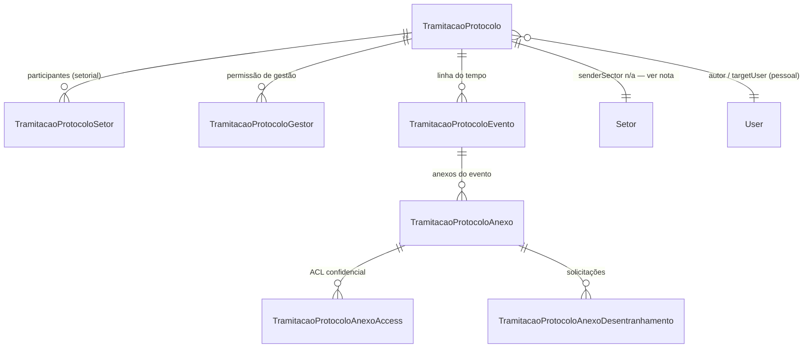

# Data Model: Tramitação como Protocolo

**Feature**: 035-tramitacao-protocolo · **Source**: spec.md → Key Entities, research.md

> Convenção de nomenclatura: entidades Prisma em PascalCase inglês/PT-BR mesclado (padrão já usado no monorepo, ex. `TramitacaoDemanda`). Campos em camelCase. Todas as tabelas têm `tenantId` (multi-tenant, AsyncLocalStorage) e seguem soft delete quando aplicável.

## Diagrama de relações



## Entidades

### TramitacaoProtocolo

Contêiner central. Substitui `TramitacaoDemanda`.

| Campo | Tipo | Notas |
|---|---|---|
| `id` | `String @id @default(uuid())` | |
| `tenantId` | `String` | multi-tenant |
| `protocolNumber` | `String` | único por tenant, formato `TRAM-AAAA-NNNN` (mantido) |
| `subject` | `String @db.VarChar(500)` | assunto/descrição |
| `tipo` | `TramitacaoProtocoloTipo` | `setorial` \| `pessoal` — imutável após criação (FR-004) |
| `status` | `TramitacaoProtocoloStatus` | `aberto` \| `encerrado` — default `aberto` |
| `autorUserId` | `String?` | `resolveUserTableId`; nullable p/ admin_tenant/admin_saas |
| `targetUserId` | `String?` | apenas quando `tipo = pessoal` (destinatário 1:1) — NOT NULL nesse caso (validado em use-case, não em schema) |
| `sourceModule` | `String?` | vínculo de origem na abertura (cross-módulo) |
| `sourceRecordId` | `String?` | idem |
| `sourceSnapshot` | `Json?` | snapshot imutável no momento da abertura |
| `encerradoAt` | `DateTime?` | preenchido ao encerrar |
| `encerradoMotivo` | `String? @db.Text` | opcional |
| `encerradoByUserId` | `String?` | quem encerrou |
| `deletedAt` | `DateTime?` | soft delete (padrão Prisma extension do projeto) |
| `createdAt` | `DateTime @default(now())` | data de abertura |
| `updatedAt` | `DateTime @updatedAt` | **usada como "última atualização"** para ordenação da lista (ver research.md §10) |

Índices: `@@unique([tenantId, protocolNumber])`, `@@index([tenantId, status, updatedAt])`, `@@index([tenantId, autorUserId])`, `@@index([tenantId, targetUserId, tipo])`, `@@index([sourceModule, sourceRecordId])`.

**Regras de validação** (aplicadas em use-case, não no schema):
- `tipo = pessoal` ⇒ `targetUserId` obrigatório e ≠ `autorUserId`; nenhuma linha em `TramitacaoProtocoloSetor` é criada.
- `tipo = setorial` ⇒ ao menos 1 linha em `TramitacaoProtocoloSetor` na criação (FR-002).
- `status = encerrado` é terminal — nenhuma transição de volta a `aberto` (FR-018).

**Transições de estado**:

```
aberto ──(encerrar, por gestor)──> encerrado (terminal)
```

### TramitacaoProtocoloSetor

Participante setor (protocolo setorial). Nova entidade — não existia como tabela associativa no modelo antigo (`senderSectorId`/`currentSectorId` eram campos únicos).

| Campo | Tipo | Notas |
|---|---|---|
| `id` | `String @id @default(uuid())` | |
| `tenantId` | `String` | |
| `protocoloId` | `String` | FK → `TramitacaoProtocolo`, `onDelete: Cascade` |
| `setorId` | `String` | FK → `Setor` |
| `incluidoPorUserId` | `String?` | quem incluiu (autor na abertura, ou gestor depois) |
| `createdAt` | `DateTime @default(now())` | |

Índices: `@@unique([protocoloId, setorId])`, `@@index([tenantId, setorId])`.

**Regra**: todo membro ativo do `setorId` (via tabela de membros de setor já existente no domínio) herda acesso de leitura/escrita ao protocolo (FR-006). Sem revogação nesta versão (Assumptions/Edge Cases da spec).

### TramitacaoProtocoloGestor

Permissão de gestão explícita, concedida a um participante além do autor (US8/FR-009).

| Campo | Tipo | Notas |
|---|---|---|
| `id` | `String @id @default(uuid())` | |
| `tenantId` | `String` | |
| `protocoloId` | `String` | FK → `TramitacaoProtocolo`, `onDelete: Cascade` |
| `userId` | `String` | quem recebe a permissão |
| `concedidoPorUserId` | `String?` | quem concedeu |
| `createdAt` | `DateTime @default(now())` | |

Índices: `@@unique([protocoloId, userId])`.

**Regra de resolução** (`canManageProtocolo`): `actor.id === protocolo.autorUserId OR EXISTS(TramitacaoProtocoloGestor WHERE protocoloId=X AND userId=actor.id)`.

### TramitacaoProtocoloEvento

Linha do tempo (atualizações). Substitui `TramitacaoDemandaEvento`.

| Campo | Tipo | Notas |
|---|---|---|
| `id` | `String @id @default(uuid())` | |
| `tenantId` | `String` | |
| `protocoloId` | `String` | FK → `TramitacaoProtocolo`, `onDelete: Cascade` |
| `tipo` | `TramitacaoProtocoloEventoTipo` | ver enum abaixo |
| `payload` | `Json?` | conteúdo específico do tipo (body, notas, `sourceModule/sourceRecordId/sourceSnapshot` quando `vinculo_anexado`, `setorId` quando `setor_incluido`, `motivo` quando `encerrado`) |
| `authorUserId` | `String?` | `resolveUserTableId` |
| `authorSectorId` | `String?` | setor do autor no momento (contexto, não participação) |
| `createdAt` | `DateTime @default(now())` | |

Índices: `@@index([protocoloId, createdAt])`.

**Enum `TramitacaoProtocoloEventoTipo`**:

```
aberto
atualizacao
setor_incluido
gestao_concedida
vinculo_anexado
encerrado
desentranhamento_solicitado
desentranhamento_aprovado
desentranhamento_rejeitado
```

### TramitacaoProtocoloAnexo

Anexo (arquivo/link) juntado a um evento. Substitui `TramitacaoDemandaAnexo` — **mesma estrutura**, apenas FK renomeada (`eventoId` → aponta para `TramitacaoProtocoloEvento`).

| Campo | Tipo | Notas |
|---|---|---|
| `id` | `String @id @default(uuid())` | |
| `tenantId` | `String` | |
| `protocoloId` | `String` | FK → `TramitacaoProtocolo`, `onDelete: Cascade` |
| `eventoId` | `String?` | FK → `TramitacaoProtocoloEvento`, `onDelete: SetNull` |
| `kind` | `TramitacaoAttachmentKind` | `file` \| `link` (enum mantido) |
| `fileName`, `mimeType`, `sizeBytes`, `storageKey`, `url`, `title` | — | inalterados |
| `uploadConfirmed` | `Boolean @default(false)` | |
| `uploadedByUserId` | `String?` | autor do anexo (usado na resolução de desentranhamento) |
| `isConfidential` | `Boolean @default(false)` | feature 033, preservada |
| `attachedAt` | `DateTime @default(now())` | |
| `desentranhadoAt` | `DateTime?` | feature 034, preservada |
| `deletedAt` | `DateTime?` | |
| `createdAt`/`updatedAt` | — | |

Índices: `@@index([protocoloId])`, `@@index([protocoloId, eventoId])`, `@@index([protocoloId, uploadConfirmed])`.

### TramitacaoProtocoloAnexoAccess

ACL de confidencialidade (033) — **inalterada**, apenas renomeada a FK pai.

| Campo | Tipo |
|---|---|
| `id`, `tenantId`, `anexoId`, `userId`, `sectorId`, `createdAt` | inalterados (mesma estrutura de `TramitacaoDemandaAnexoAccess`) |

### TramitacaoProtocoloAnexoDesentranhamento

Solicitação de desentranhamento (034) — estrutura preservada, **enum `direction` renomeado** (research.md §6).

| Campo | Tipo | Notas |
|---|---|---|
| `id`, `tenantId`, `anexoId`, `protocoloId` | — | `demandaId` → `protocoloId` |
| `direction` | `TramitacaoDesentranhamentoDirection` | `autor_solicita` \| `participante_solicita` (renome de `author_requests`/`recipient_requests`) |
| `status` | `TramitacaoDesentranhamentoStatus` | `pending` \| `approved` \| `rejected` (inalterado) |
| `requestedByUserId`, `requestReason`, `decidedByUserId`, `decisionReason`, `decidedAt` | — | inalterados |
| `createdAt`/`updatedAt` | — | inalterados |

Índice único parcial (preservado de 034): apenas 1 solicitação `pending` por anexo por vez.

## Entidades derivadas (não persistidas)

- **Dossiê exportado**: gerado sob demanda pelo `ExportProtocoloUseCase` (research.md §8) — não é uma tabela; é um artefato transiente em `StorageService` com URL presignada de expiração curta (900s, padrão do serviço).
- **Vínculo de origem (cross-módulo)**: para a abertura, vive nos campos `sourceModule/sourceRecordId/sourceSnapshot` do próprio `TramitacaoProtocolo`; para entranhamentos subsequentes (US4, entranhar em protocolo existente), vive no `payload` de um `TramitacaoProtocoloEvento` do tipo `vinculo_anexado`.

## Regras de acesso (resumo, sem mudança de comportamento vs. 033/034)

| Situação | Quem vê o conteúdo completo |
|---|---|
| Anexo não confidencial, protocolo não encerrado ou encerrado | Qualquer participante do protocolo (setor incluído ou 1:1 pessoal) |
| Anexo confidencial | Autor do anexo + usuários com grant em `TramitacaoProtocoloAnexoAccess` + `admin_tenant`/`admin_saas` |
| Anexo desentranhado (`desentranhadoAt` preenchido) | Mesmo conjunto acima, adicionalmente filtrado pela regra de "acesso original" (FR-011/012 da 034) |
| Protocolo encerrado | Somente leitura para todos — nenhuma escrita, incluindo anexos e inclusão de setor |

## Migration

Uma única migration `tramitacao_protocolo_reset`:
1. `DROP TABLE` (cascade) de todas as tabelas atuais: `TramitacaoDemandaAnexoDesentranhamento`, `TramitacaoDemandaAnexoAccess`, `TramitacaoDemandaAnexo`, `TramitacaoDemandaEvento`, `TramitacaoDemanda`, `TramitacaoDemandaSequence`.
2. `DROP TYPE` dos enums antigos (`TramitacaoDemandaOriginType`, `TramitacaoDemandaStatus`, `TramitacaoDemandaEventType`).
3. `CREATE TYPE`/`CREATE TABLE` das novas entidades listadas acima.
4. `ALTER TYPE "NotificacaoType"` — `ADD VALUE`/renomear conforme research.md §7 (Postgres não permite `DROP VALUE` de enum; os valores antigos ficam "mortos" no tipo, o que é aceitável dado que não há dados históricos a preservar — ou, alternativa mais limpa, recriar o enum inteiro já que o reset também aplica à tabela `Notificacao` filtrada por `sourceModule = 'tramitacao'`, que será truncada junto).
